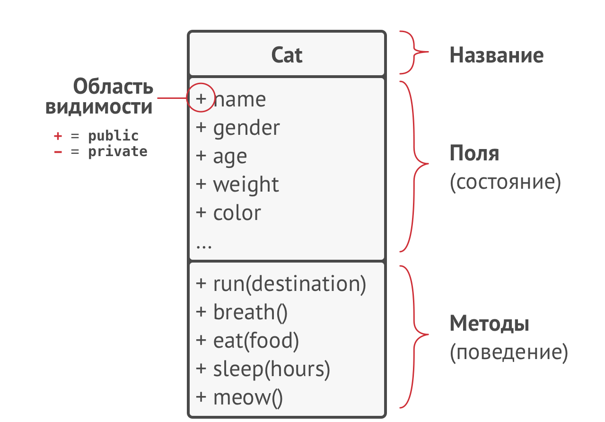
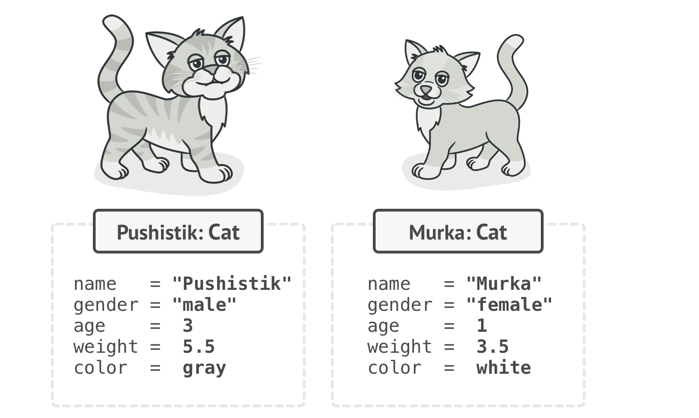
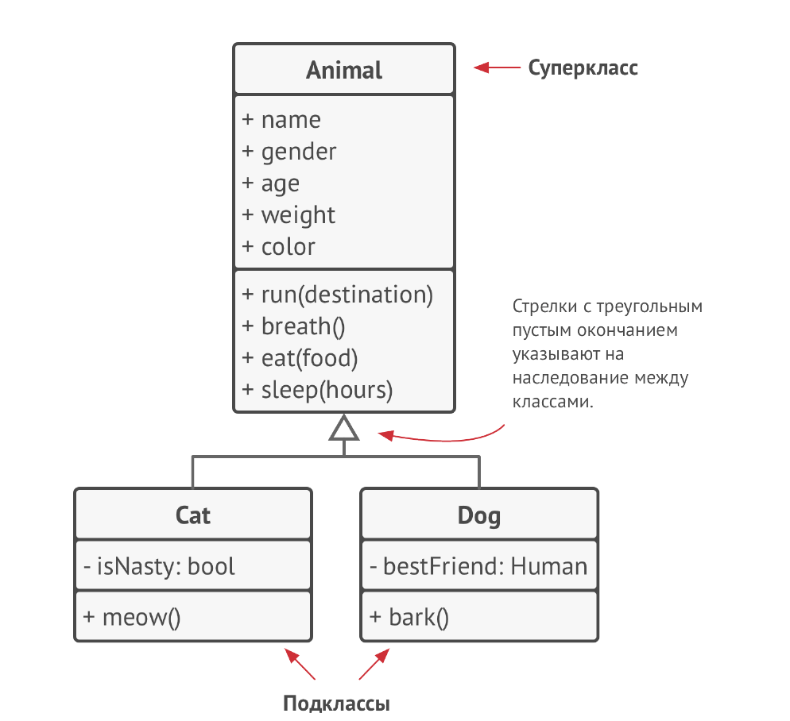
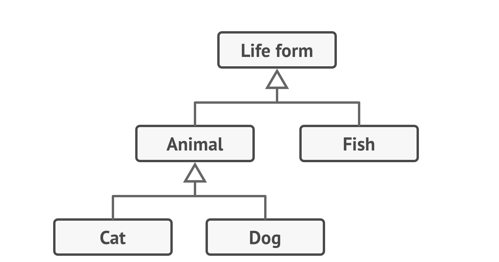
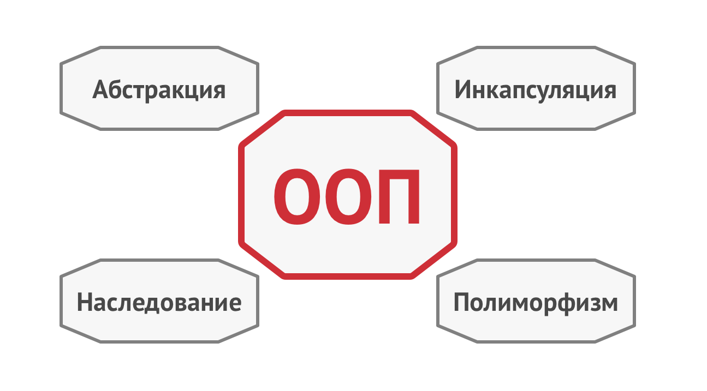

# OOП
**Объектно-ориентированное программирование** - это методология программирования, в которой важные вещи представлены 
**объектами**, каждый из которых является экземпляром определённого **класса**, а классы образуют **иерархию 
наследования**.

## UML
**UML** (***Unified Modeling Language*** - "унифицированный язык моделирования") - это графический язык, в котором 
каждой фигуре, символу, стрелке или их сочетаниям присвоены конкретные значения. Он позволяет визуализировать явление 
или процесс так, чтобы схема была понятна всем, кто знаком с UML.

### UML-диаграмма

## Классы и объекты
**Класс** - это своеобразный "чертёж", по которому строятся объекты-экземпляры этого класса.
Например, есть класс кот, а есть его экземпляры:

### Иерархии классов

Такая "пирамида" классов называется иерархией.

## Краеугольные камни ООП
ООП имеет четыре главные концепции, которые отличают его от остальных методологий программирования.

1) **Абстракция** - это модель некоего объекта или явления реального мира, откидывающая назначительные детали, не 
играющие существенной роли в данном контексте. Так, например, класс Самолёт будет актуален как для программы тренажёра 
пилотов, так и для программы бронирования авиабилетов, но в первом случае будут важны детали пилотирования самолёта, а 
во втором — лишь расположение и занятость мест внутри самолёта.

2) **Инкапсуляция** - это способность объектов скрывать часть своего состояния и поведения от других объектов, 
предоставляя внешнему миру только определённый интерфейс взаимодействия с собой. Когда вы заводите автомобиль, вам 
достаточно повернуть ключи зажигания или нажать кнопку. Вам не нужно вручную соединять провода под капотом, поворачивать
коленчатый вал и поршни, запуская такт двигателя. Все эти детали скрыты под капотом автомобиля. Вам доступен только 
простой интерфейс — кнопка зажигания, руль и педали.

3) **Наследование** - это возможность создания новых классов на основе существующих. Главная польза от наследования — 
повторное использование существующего кода. Расплата за наследование проявляется в том, что подклассы всегда следуют 
интерфейсу родительского класса

4) **Полиморфизм** - это способность программы выбирать различные реализации, при вызове операций с одним и тем же
названием. Полиморфизм - это способность объектов притворяться чем-то другим. Программе не известен конкретный 
класс объекта, который наследовался от класса Фигура, но благодаря специальному механизму, называемому полиморфизмом, 
будет запущен тот метод вычисления площади, который соответствует реальному классу объекта, например Треугольника.

## Отношения между объектами
1) **Наследование** 
2) **Реализация**
3) **Ассоциация** - это когда один объект использует другой, либо зависит от него. (Учитель -> ученик)
4) **Композиция** - это отношение "часть-целое" между двумя объектами, когда один из них включает в себя другой. 
(Университет -> кафедра)
5) **Агрегация** - это менее строгий вариант композиции, когда один объект просто имеет ссылку на другой объект.
(Кафедра -> профессор)

# Паттерны

**Паттерны проектирования** - это часто встречаемое решение определённой проблемы при проектировании архитектуры 
программ.

В отличие от готовых функций или библиотек, паттерн нельзя просто взять и скопировать в программу. Паттерн представляет 
собой не какой-то конкретный код, а общую концепцию или пример решения той или иной проблемы, которое нужно будет 
подстроить под нужды вашей программы.

Паттерны не алгоритмы. И если алгоритм — это чёткий набор действий, то паттерн — это высокоуровневое описание решения, 
реализация которого может отличаться в двух разных программах.

## Из чего состоит паттерн?

Описания паттернов обычно очень формальны и чаще всего состоят из таких пунктов:
1) проблемы, которую решает паттерн;
2) мотивации к решению проблемы способом, который предлагает паттерн;
3) структуры классов, составляющих решение;
4) примера на одном из языков программирования;
5) особенностей реализации в различных контекстах;
6) связей с другими паттернами.

## Классификация паттернов

Паттерны отличаются по уровню сложности, детализации и охвата проектируемой системы. Самые низкоуровневые и простые 
паттерны — **идиомы**. Они не очень универсальные, так как применимы только в рамках одного языка программирования. Самые 
универсальные — **архитектурные паттерны**, которые можно реализовать практически на любом языке. Они нужны для 
проектирования всей программы, а не отдельных её элементов.

Кроме этого, паттерны отличаются и предназначением. Три группы:
1) **Порождающие паттерны** беспокоятся о гибком создании объектов без внесения в программу лишних зависимостей.
2) **Структурные паттерны** показывают различные способы построения связей между объектами.
3) **Поведенческие паттерны** заботятся об эффективной коммуникации между объектами.

## Зачем знать паттерны?

1) Проверенные решения;
2) Стандартизация кода;
3) Общий программистский словарь.

# Принципы SOLID

## Single responsibility principle

**Принцип единой ответственности** 
* У класса должна быть только один мотив для изменения.
* Стремитесь к тому, чтобы каждый класс отвечал только за одну часть функциональности программы, причём она должна быть 
полностью инкапсулирована в этот класс.

## Open/closed princeple

**Принцип открытости/закрытости**
* Расширяйте классы, но не изменяйте их первоначальный код.
* Стремитесь к тому, чтобы классы были открыты для расширения, но закрыты для изменения. Главная идея этого принципа в 
том, чтобы не ломать существующий код при внесении изменений в программу.

## Liskov substitution principle

**Принцип подстановки Лисков**
* Подклассы должны дополнять, а не замещать поведение базового класса.
* Стремитесь создавать подклассы таким образом, чтобы их объекты можно было бы подставлять вместо объектов базового 
класса, не ломая при этом функциональности клиентского кода.

## Interface segregation principle

**Принцип разделения интерфейса**
* Клиенты не должны зависеть от методов, которые они не используют.
* Стремитесь к тому, чтобы интерфейсы были достаточно узкими, чтобы классам не приходилось реализовывать избыточное 
поведение.

## Dependency inversion principle

**Принцип инверсии зависимостей**
* Классы верхних уровней не должны зависеть от классов нижних уровней. Оба должны зависеть от абстракций. Абстракции не 
должны зависеть от деталей. Детали должны зависеть от абстракций.