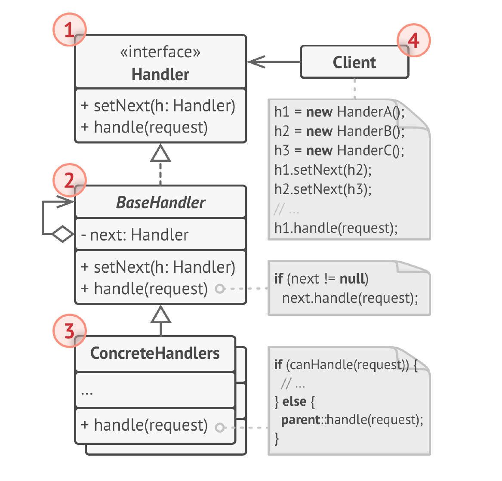

# Цепочка обязанностей
**Цепочка обязанностей** (***Chain of Commands***) — это поведенческий паттерн
проектирования, который позволяет передавать запросы
последовательно по цепочке обработчиков. Каждый
последующий обработчик решает, может ли он обработать
запрос сам и стоит ли передавать запрос дальше по цепи.

## Проблема
1) Тесная связь между отправителем запроса и его получателями: Отправитель должен знать всех потенциальных получателей и их порядок, что создает жесткую зависимость и затрудняет изменение обработки запросов. Добавление нового обработчика или изменение порядка существующих требует изменения кода отправителя.

2) Сложная логика выбора обработчика: Отправителю приходится реализовывать логику определения подходящего обработчика для каждого запроса, что делает код отправителя более сложным и менее гибким.

3) Дублирование кода обработки запросов: Если несколько отправителей нуждаются в одинаковой логике обработки запросов, код выбора обработчика может дублироваться, что нарушает принцип DRY (Don't Repeat Yourself).

4) Проблемы с расширяемостью: Добавление новых типов запросов и обработчиков требует изменения существующего кода, что затрудняет расширение системы.

5) Непрозрачность обработки: Сложно отследить, какой обработчик в конечном итоге обработал запрос, что затрудняет отладку и анализ работы системы.

## Решение
1) Развязка отправителя и получателей: Отправитель просто отправляет запрос в цепочку, не зная, какой конкретный обработчик его обработает. Каждый обработчик в цепочке решает, может ли он обработать запрос. Если может, он его обрабатывает; если нет, передает следующему обработчику в цепочке.

2) Упрощение логики выбора обработчика: Логика выбора обработчика распределяется между самими обработчиками. Каждый обработчик отвечает только за решение, может ли он обработать запрос, что упрощает код каждого отдельного обработчика и избавляет отправителя от этой ответственности.

3) Исключение дублирования кода: Логика обработки каждого типа запроса инкапсулируется в отдельном обработчике. Это позволяет избежать дублирования кода обработки запросов в разных частях приложения.

4) Повышение расширяемости: Добавление новых обработчиков сводится к добавлению нового звена в цепочку. Это не требует изменения существующего кода отправителя или других обработчиков. Просто нужно настроить цепочку, добавив новый обработчик в нужное место.

5) Прозрачность обработки (опционально): Можно добавить логирование или другие механизмы отслеживания в обработчики, чтобы видеть, какой обработчик обработал запрос и как он это сделал. Это упрощает отладку и мониторинг системы.

## Структура

1. Обработчик определяет общий для всех конкретных
   обработчиков интерфейс. Обычно, достаточно описать
   единственный метод обработки запросов, но иногда здесь
   может быть определён и метод выставления следующего
   обработчика.
2. Базовый обработчик — опциональный класс, который
   позволяет избавиться от дублирования одного и того же
   кода во всех конкретных обработчиках.
   Обычно, этот класс имеет поле для хранения ссылки на
   следующий обработчик в цепочке. Клиент связывает
   обработчики в цепь, подавая ссылку на следующий
   обработчик в конструктор или сеттер, определённый здесь.
   Здесь можно реализовать и метод обработки, который бы
   просто перенаправлял запрос следующему объекту,
   проверив его наличие.
3. Конкретные обработчики содержат код обработки
   запросов. При получении запроса каждый обработчик
   решает, может ли он обработать запрос или нет, а также
   стоит ли передать его следующему объекту.
   В большинстве случаев, обработчики могут работать сами
   по себе и быть неизменяемыми, получив все нужные
   детали из параметров конструктора.
4. Клиент составляет цепочки обработчиков один раз или
   динамически, в зависимости от логики программы. Клиент
   может отправить запрос любому из объектов цепочки,
   причём это не всегда первый объект в цепочке.

## Примеры
### Аналогия из жизни
Когда у вас что-то сломалось и вы звоните в поддержку, то это похоже на цепочку комманд:
сначала вам отвечает робот, потом живой человек, если и это не помогает, то вас переводят к 
техническому специалисту.

### Данный пример
Этот пример создает простое приложение Swing с несколькими кнопками. Каждая кнопка запрашивает помощь по определенной теме ("button", "menu", "unknown"). Цепочка обработчиков (ButtonHelpHandler и MenuHelpHandler) обрабатывает эти запросы. Если обработчик может обработать тему, он отображает сообщение со справкой. Если нет, передает запрос следующему обработчику. Если ни один обработчик не может обработать запрос, выводится сообщение "Справка по этой теме не найдена".

### Из JDK
1) java.util.logging.Logger: Логгеры организованы в иерархию, подобную цепочке. Каждый логгер может либо обработать сообщение лога, либо передать его своему родителю. Это позволяет настраивать логирование на разных уровнях детализации для разных частей приложения.

2) javax.servlet.Filter: Фильтры в сервлетах образуют цепочку, через которую проходит каждый запрос и ответ. Каждый фильтр может выполнить некоторую предобработку запроса, пост-обработку ответа, или передать управление следующему фильтру в цепочке. Это позволяет реализовать такие функции, как аутентификация, авторизация, логирование и сжатие данных.

### Дополнительно
Клиент должен знать о динамической природе цепочки и
быть готов к таким случаям:
* Цепочка может состоять из единственного объекта.
* Запросы могут не достигать конца цепи.
* Запросы могут достигать конца, оставаясь
необработанными.