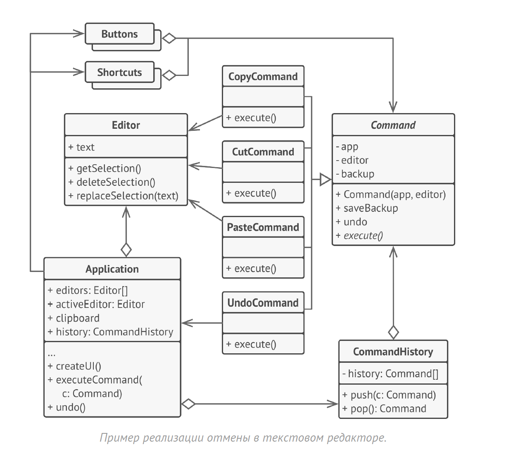

# Команда
**Команда** (***Command***) — это поведенческий паттерн проектирования,
который превращает запросы в объекты, позволяя
передавать их как аргументы при вызове методов, ставить
запросы в очередь, логировать их, а также поддерживать
отмену операций.

## Проблема
1) Тесная связь между вызывающим и выполняющим объектом. Вызывающий код должен знать конкретный тип выполняющего объекта и его интерфейс. Это затрудняет изменение поведения системы, добавление новых команд или замену существующих.

2) Сложность отмены операций. Если операция состоит из нескольких шагов, отмена её становится сложной. Необходимо отслеживать все выполненные действия и иметь механизм их обратного выполнения.

3) Сложность реализации журналирования и повтора операций. Для журналирования необходимо сохранять информацию о каждой выполненной команде. Для повтора операций необходимо иметь возможность восстановить команду из журнальной записи и выполнить её повторно.

4) Сложность реализации пакетных операций (транзакций). Выполнение группы команд как единого целого требует дополнительной логики для обеспечения атомарности операций (либо все выполняются, либо ни одна).

5) Затруднения в реализации асинхронного выполнения команд. Выполнение команды в отдельном потоке требует управления состоянием команды и уведомления о завершении.

## Решение
1) Развязка вызывающего и выполняющего объекта: Команда инкапсулирует запрос как объект. Вызывающий код взаимодействует с интерфейсом команды, не зная конкретного типа исполнителя. Это позволяет легко добавлять новые команды и менять исполнителей без изменения вызывающего кода.

2) Упрощение отмены операций: Интерфейс команды может включать метод undo(), который выполняет обратные действия. Это позволяет легко отменять выполненные команды. Сложные операции, состоящие из нескольких шагов, могут быть представлены составной командой, которая отменяет все свои подкоманды.

3) Упрощение журналирования и повтора операций: Команды, будучи объектами, могут быть легко сериализованы и сохранены в журнале. Для повтора операции достаточно десериализовать команду из журнала и вызвать её метод execute().

4) Упрощение реализации пакетных операций: Команды могут быть объединены в составную команду, которая выполняет все свои подкоманды как единое целое. Это обеспечивает атомарность операций.

5) Упрощение реализации асинхронного выполнения команд: Команда может быть выполнена в отдельном потоке. Состояние команды (выполнена, не выполнена, ошибка) может быть отслежено, и вызывающий код может быть уведомлен о завершении выполнения.

## Структура

1. Отправитель хранит ссылку на объект команды и
   обращается к нему, когда нужно выполнить какое-то
   действие. Отправитель работает с командами только через
   их общий интерфейс. Он не знает, какую конкретно
   команду использует, так как получает готовый объект
   команды от клиента.
2. Команда описывает общий для всех конкретных команд
   интерфейс. Обычно, здесь описан всего один метод для
   запуска команды.
3. Конкретные команды реализуют различные запросы,
   следуя общему интерфейсу команд. Обычно, команда не
   делает всю работу самостоятельно, а лишь передаёт вызов
   получателю — определённому объекту бизнес-логики.
   Параметры, с которыми команда обращается к получателю,
   следует хранить в виде полей. В большинстве случаев,
   объекты команд можно сделать неизменяемым, предавая в
   них все необходимые параметры только через конструктор.
4. Получатель содержит бизнес-логику программы. В этой
   роли может выступать практически любой объект. Обычно,
   команды перенаправляют вызовы получателям. Но иногда,
   чтобы упростить программу, вы можете избавиться от
   получателей, слив их код в классы команд.
5. Клиент создаёт объекты конкретных команд, передавая в
   них все необходимые параметры, а иногда и ссылки на
   объекты получателей. После этого, клиент конфигурирует
   отправителей созданными командами.

## Примеры
### Аналогия из жизни
Вы заходите в ресторан и садитесь у окна. К вам подходит
вежливый официант и принимает заказ, записывая все
пожелания в блокнот.

Откланявшись, он уходит на кухню, где вырывает лист из
блокнота и клеит на стену. Сорвав лист со стены, шеф
читает содержимое заказа и готовит блюдо, которое вы
заказали.

В этом примере, вы являетесь отправителем, официант с
блокнотом — командой, а шеф — получателем. Как и в
паттерне, вы не соприкасаетесь напрямую с шефом. Вместо
этого, вы отправляете заказ с официантом, который
самостоятельно «настраивает» шефа на работу.

### Данный пример
Вот его схема:

### Из JDK
1) Runnable и Callable: Эти интерфейсы определяют единицу работы, которая может быть выполнена. Runnable не возвращает результат, в то время как Callable возвращает значение. Они используются для асинхронного выполнения задач, например, в ExecutorService. Хотя они не имеют метода undo(), они инкапсулируют операцию, подобно команде.

2) ActionListener: Этот интерфейс используется для обработки событий, например, нажатия кнопки. Объект, реализующий ActionListener, содержит код, который будет выполнен в ответ на событие. Это похоже на выполнение команды, связанной с событием.

3) javax.swing.Action: Этот интерфейс расширяет ActionListener и добавляет функциональность для управления состоянием действия (например, включено/отключено) и предоставления информации о нём (например, имя, иконка). Action объекты часто используются в Swing для представления команд, связанных с элементами пользовательского интерфейса.

4) java.awt.EventQueue.invokeLater() и invokeAndWait(): Эти методы позволяют выполнять код в потоке диспетчеризации событий. Передаваемый Runnable можно рассматривать как команду, которая должна быть выполнена в определенном контексте.
