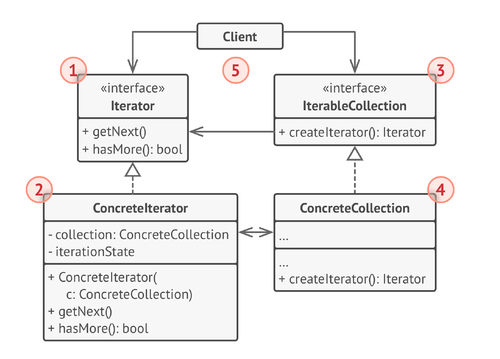

# Итератор
**Итератор** (***Iterator***) — это поведенческий паттерн проектирования,
который даёт возможность последовательно обходить
элементы составных объектов, не раскрывая их
внутреннего представления.

## Проблема
1) Зависимость от внутренней структуры коллекции: Без итератора клиентский код должен знать, как именно коллекция хранит свои элементы (массив, связный список и т.д.), чтобы получить к ним доступ. Это создает жесткую зависимость и усложняет код.

2) Различные способы обхода коллекции: Разные коллекции могут требовать разных способов обхода (например, прямой, обратный, по определенному критерию). Без итератора клиентский код должен реализовывать эти способы обхода самостоятельно.

3) Усложнение клиентского кода: Код, который напрямую обращается к элементам коллекции, становится сложнее и менее понятным.

4) Нарушение принципа единственной ответственности (Single Responsibility Principle): Класс, отвечающий за хранение коллекции и за ее обход, нарушает принцип единственной ответственности.

## Решение
1) Абстрагирование доступа к элементам: Итератор предоставляет общий интерфейс для доступа к элементам коллекции, независимо от ее внутренней структуры. Клиентский код взаимодействует с итератором, а не с самой коллекцией напрямую.

2) Инкапсуляция логики обхода: Логика обхода коллекции инкапсулируется внутри итератора. Клиентский код не должен знать, как именно коллекция хранит свои элементы и как их обходить. Итератор предоставляет простые методы, такие как hasNext() и next(), для последовательного доступа к элементам.

3) Упрощение клиентского кода: Клиентский код становится проще и понятнее, так как не нужно реализовывать логику обхода коллекции.

4) Поддержка различных способов обхода: Итератор может поддерживать различные способы обхода коллекции, например, прямой, обратный или обход по определенному критерию. Это достигается путем создания разных реализаций интерфейса Iterator.

5) Разделение ответственности: Итератор отделяет ответственность за хранение коллекции от ответственности за ее обход, что соответствует принципу единственной ответственности.

## Структура

1. Итератор описывает интерфейс для доступа и обхода
   элементов коллекции.
2. Конкретный итератор реализует алгоритм обхода какой-то
   конкретной коллекции. Объект итератора должен сам
   отслеживать текущую позицию при обходе коллекции,
   чтобы отдельные итераторы могли обходить одну и ту же
   коллекцию независимо.
3. Коллекция описывает интерфейс получения итератора из
   коллекции. Как мы уже говорили, коллекции не всегда
   являются списком. Это может быть и база данных, и
   удалённое API, и даже дерево Компоновщика. Поэтому
   сама коллекция может создавать итераторы, так как она
   знает, какие именно итераторы могут с ней работать.
4. Конкретная коллекция возвращает новый экземпляр
   определённого конкретного итератора, связав его с
   текущим объектом коллекции. Обратите внимание, что
   сигнатура метода возвращает интерфейс итератора. Это
   позволяет клиенту не зависеть от конкретных классов
   итераторов.
5. Клиент работает со всеми объектами через интерфейсы
   коллекции и итератора. Так клиентский код не зависит от
   конкретного класса итератора, что позволяет применять
   различные итераторы, не изменяя существующий код
   программы.
   В общем случае клиенты не создают объекты итераторов, а
   получают их из коллекций. Тем не менее, если клиенту
   требуется специальный итератор, он всегда может создать
   его самостоятельно.

## Примеры
### Аналогия из жизни
Вы планируете полететь в Рим и обойти все
достопримечательности за пару дней. Но приехав, вы
можете долго петлять узкими улочками, пытаясь найти
Колизей. Если у вас ограниченный бюджет — не беда. Вы
можете воспользоваться виртуальным гидом, скачанным на
телефон, который позволит отфильтровать только
интересные вам точки. А можете плюнуть и нанять
локального гида, который хоть и обойдётся в копеечку, но
знает город как свои пять пальцев и сможет посвятить вас
во все городские легенды.

Таким образом, Рим выступает коллекцией
достопримечательностей, а ваш мозг, навигатор или гид —
итератором по коллекции. Вы, как клиентский код, можете
выбрать один из итераторов, опираясь на решаемую задачу
и доступные ресурсы.

### Данный пример
Реализация построчного чтения из файла.

### Из JDK
1) java.util.Iterator interface: Это основной интерфейс паттерна Итератор в Java. Он определяет методы hasNext(), next(), и remove().

2) java.util.Iterable interface: Этот интерфейс требует реализации метода iterator(), который возвращает объект Iterator. Все стандартные коллекции в Java (List, Set, Queue и т.д.) реализуют Iterable, что позволяет использовать их с циклом for-each (enhanced for loop).
