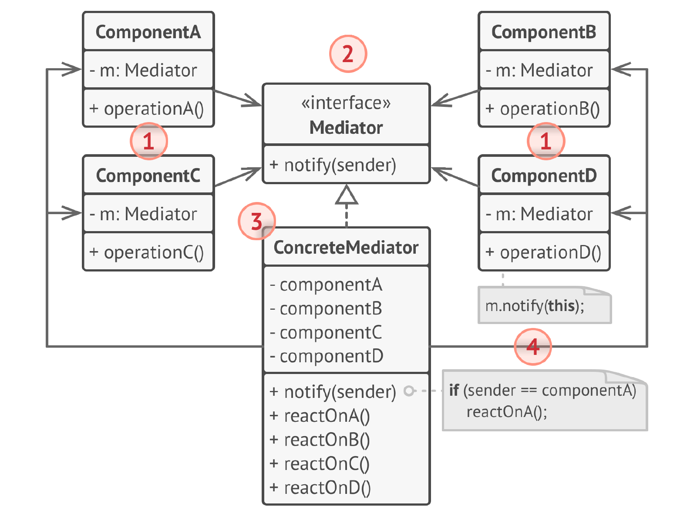
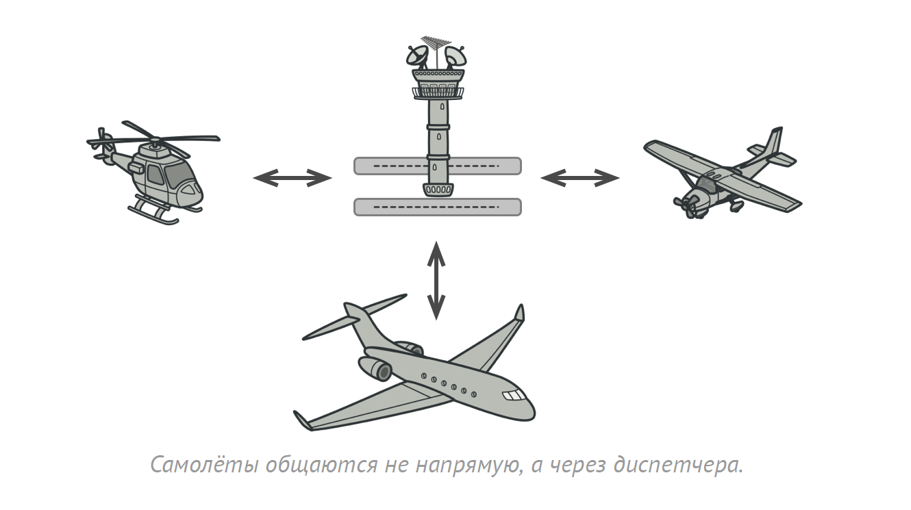

# Посредник
**Посредник** (***Mediator***) — это поведенческий паттерн проектирования,
который позволяет уменьшить связанность множества
классов между собой, благодаря перемещению этих связей
в один класс-посредник.

## Проблема
1) Тесная связь между объектами: Каждый объект должен знать о других объектах, с которыми он взаимодействует, что приводит к созданию сложной сети зависимостей. Это затрудняет изменение, добавление или удаление объектов, так как требует модификации кода во многих местах.

2) Сложность управления взаимодействием: Логика взаимодействия между объектами размазана по самим объектам, что делает её сложной для понимания, отладки и модификации. Добавление новых типов взаимодействия может потребовать изменения кода во всех взаимодействующих объектах.

3) Проблемы с повторным использованием: Объекты, тесно связанные с другими объектами, сложно использовать повторно в других контекстах, так как их логика взаимодействия жестко привязана к конкретным объектам.

4) Затрудненное тестирование: Тестирование взаимодействия между объектами становится сложным, так как необходимо создавать и настраивать множество взаимосвязанных объектов.

## Решение
1) Уменьшение связанности: Объекты взаимодействуют друг с другом только через посредника, что значительно уменьшает количество зависимостей между ними. Добавление, удаление или изменение объектов становится проще, так как требует модификации только кода посредника.

2) Централизованное управление взаимодействием: Вся логика взаимодействия перемещается в посредника, что делает её более понятной, простой в отладке и модификации. Добавление новых типов взаимодействия требует изменения только кода посредника.

3) Повышение повторного использования: Объекты, взаимодействующие через посредника, становятся более независимыми и могут быть легко использованы повторно в других контекстах.

4) Упрощение тестирования: Тестирование взаимодействия между объектами упрощается, так как достаточно протестировать взаимодействие каждого объекта с посредником и логику самого посредника.

## Структура

1. Компоненты — это разнородные объекты, содержащие
   бизнес-логику программы. Каждый компонент хранит
   ссылку на объект посредника, но работает с ним только
   через абстрактный интерфейс посредников. Благодаря
   этому, компоненты можно повторно использовать в другой
   программе, связав их с посредником другого типа.
2. Посредник определяет интерфейс для обмена
   информацией с компонентами. Обычно хватает одного
   метода для оповещения посредника о событиях,
   произошедших в компонентах. В параметрах этого метода
   можно передавать детали события: ссылку на компонент, в
   котором оно произошло, и любые другие данные.
3. Конкретный посредник содержит код взаимодействия
   нескольких компонентов между собой. Этот объект создаёт
   и хранит ссылки на компоненты системы.
4. Компоненты не должны общаться напрямую друг с другом.
   Если в компоненте происходит важное событие, влияющее
   на других, он должен оповестить своего посредника. А тот,
   в свою очередь, самостоятельно передаст вызов другим
   компонентам, если это потребуется. При этом компонент-
   отправитель не знает, кто обработает его запрос, а
   компонент-получатель не знает, кто его прислал.

## Примеры
### Аналогия из жизни
Пилоты садящихся или улетающих самолётов не общаются
напрямую с другими пилотами. Вместо этого, они
связываются с диспетчером, который координирует
действия нескольких самолётов одновременно. Без
диспетчера, пилотам приходилось бы все время быть
начеку и следить за всеми окружающими самолётами
самостоятельно. А это приводило бы к частым катастрофам
в небе.

Важно понимать, что диспетчер не нужен во время всего
полёта. Он задействован только в зоне аэропорта, когда
нужно координировать взаимодействие многих самолётов.
### Данный пример
Реализуем аналогию из жизни:

### Из JDK
1) java.util.concurrent.ExecutorService: ExecutorService выступает в роли посредника между задачами (Runnable или Callable) и потоками, которые их выполняют. Он управляет распределением задач по потокам, очередями задач и другими аспектами асинхронного выполнения. Разработчик не взаимодействует напрямую с потоками, а использует ExecutorService для управления выполнением задач.

2) java.awt.EventQueue: EventQueue в AWT действует как посредник для событий графического интерфейса. Компоненты генерируют события, а EventQueue доставляет их слушателям. Компоненты не знают друг о друге, они просто отправляют события в очередь, а EventQueue распределяет их соответствующим слушателям. Это упрощает управление событиями и уменьшает связанность между компонентами.
