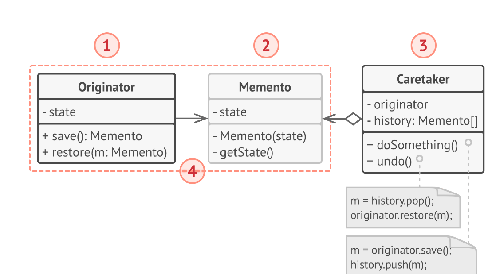
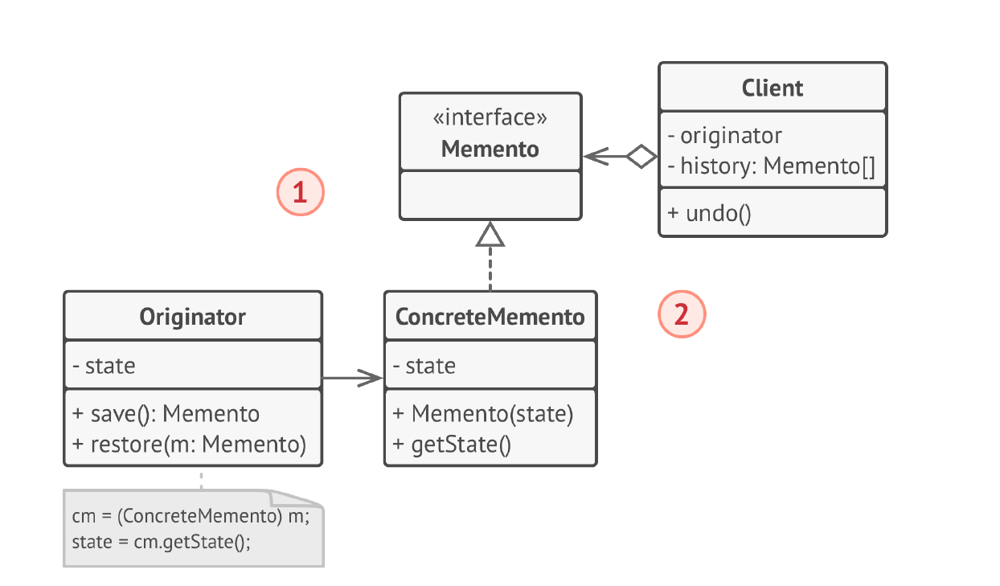
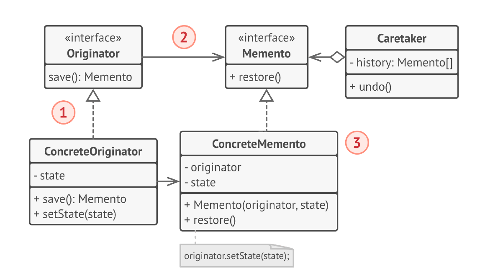

# Снимок
**Снимок** (***Memento***) — это поведенческий паттерн проектирования,
который позволяет делать снимки состояния объектов, не
раскрывая подробностей их реализации. Затем снимки
можно использовать, чтобы восстановить прошлое
состояние объектов.

## Проблема
1) Нарушение инкапсуляции: Для сохранения состояния объекта внешний код должен иметь доступ к его внутренним полям. Это нарушает принцип инкапсуляции и делает объект зависимым от внешнего кода.

2) Сложность сохранения и восстановления: Если у объекта сложное внутреннее состояние, сохранение и восстановление всех его полей может быть трудоемким и подверженным ошибкам.

3) Увеличение потребления памяти: Хранение полной копии объекта для каждого сохраненного состояния может привести к значительному увеличению потребления памяти, особенно если объект большой или сохраняется много состояний. Это особенно актуально, если сохраняются только небольшие изменения между состояниями.

4) Затруднения при работе с несколькими состояниями: Управление несколькими сохраненными состояниями объекта может быть сложным, если не используется специальный механизм для их хранения и организации.

5) Потенциальные проблемы с согласованностью данных: Если объект изменяется во время сохранения его состояния, сохраненный снимок может быть некорректным или неполным.

## Решение
1) Сохранение инкапсуляции: Memento предоставляет узкий интерфейс для доступа к сохраненному состоянию, не раскрывая внутреннюю структуру объекта Originator. Только Originator имеет полный доступ к внутренним данным Memento, что сохраняет инкапсуляцию.

2) Упрощение сохранения и восстановления: Originator сам отвечает за создание Memento и восстановление своего состояния из него. Это упрощает процесс сохранения и восстановления и уменьшает вероятность ошибок.

3) Оптимизация потребления памяти: Memento может хранить только те части состояния объекта, которые необходимы для восстановления, а не полную копию объекта. Это позволяет оптимизировать потребление памяти, особенно если изменения между состояниями небольшие.

4) Управление несколькими состояниями: Внешний код (Caretaker) может хранить и управлять коллекцией Memento, обеспечивая доступ к различным сохраненным состояниям.

5) Гарантия согласованности данных: Создание Memento происходит в один момент времени, что гарантирует согласованность сохраненных данных. Внешний код не может изменить состояние Memento после его создания.

## Структура
Классическая реализация на вложенных классах:

1. Создатель делает снимки своего состояния по запросу, а
   также воспроизводит прошлое состояние, если подать в
   него готовый снимок.
2. Снимок — это простой объект данных, содержащий
   состояние создателя. Надёжней всего сделать объекты
   снимков неизменяемыми и передавать в них состояние
   только через конструктор.
3. Опекун должен знать, когда делать снимок создателя и
   когда его нужно восстанавливать.
   Опекун может хранить историю прошлых состояний
   создателя в виде стека из снимков. Если понадобится
   сделать отмену, он возьмёт последний снимок и передаст
   его создателю для восстановления.
4. В этой реализации снимок — это внутренний класс по
   отношению к классу создателя, поэтому тот имеет полный
   доступ к его полям и методам, несмотря на то, что они
   объявлены приватными. Опекун же не имеет доступа ни к
   состоянию, ни к методам снимков и может всего лишь
   хранить ссылки на эти объекты.

Реализация с промежуточным пустым интерфейсом:

1. В этой реализации создатель работает напрямую с
   конкретным классом снимка, а опекун — только с его
   ограниченным интерфейсом.
2. Благодаря этому достигается тот же эффект, что и в
   классической реализации. Создатель имеет полный доступ
   к снимку, а опекун — нет.

Снимки с повышенной защитой:

1. Эта реализация разрешает иметь несколько видов
   создателей и снимков. Каждому классу создателей
   соответствует собственный класс снимков. Ни создатели, ни
   снимки не позволяют прочесть их состояние.
2. Здесь опекун ещё более жёстко ограничен в доступе к
   состоянию создателей и снимков. Но с другой стороны,
   опекун становится независим от создателей, так как метод
   восстановления теперь находится в самих снимках.
3. Снимки теперь связаны с теми создателями, из которых они
   сделаны. Они по-прежнему получают состояние через
   конструктор. Благодаря близкой связи между классами,
   снимки знают, как восстановить состояние своих
   создателей.

## Примеры
### Из JDK
java.io.Serializable и сериализация: Сериализация позволяет сохранять состояние объекта в поток байтов, который затем можно использовать для восстановления объекта в его предыдущем состоянии. Это похоже на создание снимка состояния объекта, хотя и с более широкой целью, чем просто откат изменений. Сериализация не является чистым Memento, так как она не ограничивает доступ к внутреннему состоянию объекта так, как это делает Memento. Тем не менее, она часто используется для достижения аналогичных целей.

### Дополнительно
Вот как Git использует подход, подобный Снимку:

1) Коммиты как снимки: Каждый коммит в Git представляет собой снимок всего репозитория (или его части, если используются sparse checkouts) на определенный момент времени. Он не хранит различия между версиями файлов, как некоторые другие системы контроля версий, а сохраняет полное состояние файлов в этом коммите.

2) Ветвление и слияние: Ветвление в Git эффективно создает новые, независимые линии разработки, основанные на снимках состояния. Слияние ветвей объединяет изменения, сделанные в разных снимках.

3) Откат к предыдущим состояниям: Благодаря тому, что каждый коммит — это снимок, Git позволяет легко вернуться к любому предыдущему состоянию репозитория, просто "переключившись" на соответствующий коммит.

4) SHA-1 хеши для идентификации снимков: Каждый коммит идентифицируется уникальным SHA-1 хешем, который вычисляется на основе содержимого снимка. Это гарантирует целостность снимков и позволяет легко сравнивать их.

Хотя Git не использует классы Memento и Originator в явном виде, его внутренняя структура и механизмы работы очень близки к принципам паттерна Снимок. Можно сказать, что Git предоставляет высокоэффективную и оптимизированную реализацию идеи снимков для управления версиями.