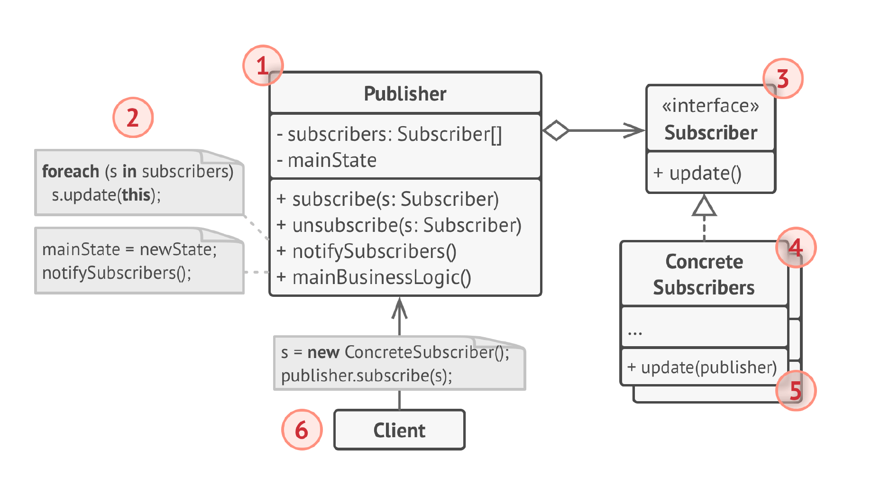

# Наблюдатель
**Наблюдатель** (***Observer***) — это поведенческий паттерн
проектирования, который создаёт механизм подписки,
позволяющий одним объектам следить и реагировать на
события, происходящие в других объектах.

## Проблема
1) Зависимость один-ко-многим между объектами: Один объект (наблюдаемый) должен уведомлять множество других объектов (наблюдателей) об изменениях своего состояния. Прямое взаимодействие между наблюдаемым объектом и каждым наблюдателем создает жесткую зависимость и усложняет код.

2) Изменение состояния наблюдаемого объекта: Наблюдатели должны быть уведомлены об изменении состояния наблюдаемого объекта, но наблюдаемый объект не должен знать, как именно наблюдатели будут реагировать на эти изменения.

3) Динамическое добавление и удаление наблюдателей: Должна быть возможность добавлять и удалять наблюдателей во время выполнения программы, без изменения кода наблюдаемого объекта.

4) Расширение функциональности без изменения кода: Добавление новых наблюдателей не должно требовать изменения кода наблюдаемого объекта.

5) Избежание циклических зависимостей: Прямое взаимодействие между наблюдаемым объектом и наблюдателями может привести к циклическим зависимостям, что затрудняет поддержку и развитие кода.

## Решение
1) Определение интерфейсов: Observer определяет два основных интерфейса:
Subject (Наблюдаемый): Интерфейс, который предоставляет методы для регистрации, удаления и уведомления наблюдателей.
Observer (Наблюдатель): Интерфейс, который содержит метод update(), вызываемый наблюдаемым объектом для уведомления наблюдателя об изменениях.

2) Подписка наблюдателей: Наблюдатели регистрируются у наблюдаемого объекта, выражая свою заинтересованность в получении уведомлений. Наблюдаемый объект хранит список зарегистрированных наблюдателей.

3) Уведомление наблюдателей: При изменении состояния наблюдаемый объект итерирует по списку зарегистрированных наблюдателей и вызывает метод update() для каждого из них.

4) Обработка уведомлений: Наблюдатели получают уведомления через метод update() и выполняют необходимые действия в соответствии с изменением состояния наблюдаемого объекта.

5) Динамическое добавление/удаление: Наблюдатели могут быть добавлены или удалены из списка наблюдаемого объекта в любой момент времени.

## Структура

1. Издатель владеет внутренним состоянием, изменение
   которого интересно для подписчиков. Он содержит
   механизм подписки — список подписчиков, а также методы
   подписки/отписки.
2. Когда внутреннее состояние издателя меняется, он
   оповещает своих подписчиков. Для этого издатель
   проходит по списку подписчиков и вызывает их метод
   оповещения, заданный в интерфейсе подписчика.
3. Подписчик определяет интерфейс, которым пользуется
   издатель для отправки оповещения. В большинстве
   случаев, для этого достаточно единственного метода.
4. Конкретные подписчики выполняют что-то в ответ на
   оповещение, пришедшее от издателя. Эти классы должны
   следовать общему интерфейсу подписчиков, чтобы
   издатель не зависел от конкретных классов подписчиков.
5. По приходу оповещения, подписчику нужно получить
   обновлённое состояние издателя. Издатель может передать
   это состояние через параметры метода оповещения. Более
   гибкий вариант — передавать через параметры весь объект
   издателя, чтобы подписчик сам мог получить требуемые
   данные. Как вариант, подписчик может постоянно хранить
   ссылку на объект издателя, переданный ему в конструкторе.
6. Клиент создаёт объекты издателей и подписчиков, а затем
   регистрирует подписчиков на обновления в издателях.

## Примеры
### Аналогия из жизни
После того как вы оформили подписку на газету или
журнал, вам больше не нужно ездить в супермаркет и
проверять, не вышел ли очередной номер. Вместо этого,
издательство будет присылать новые номера сразу после
выхода прямо к вам домой.

Издательство ведёт список подписчиков и знает, кому какой
журнал слать. Вы можете в любой момент отказаться от
подписки, и журнал перестанет к вам приходить.

### Данный пример
В данном примере у нас есть температурный сенсор, который при изменении должен обновлять дисплей и сообщать об опасности.

### Из JDK
1) java.util.Observable: Класс, который хотят наблюдать, наследуется от Observable. Он содержит методы для добавления, удаления и уведомления наблюдателей.
   java.util.Observer: Классы, которые хотят наблюдать за изменениями, реализуют интерфейс Observer. Он содержит метод update(), который вызывается при изменении наблюдаемого объекта.
2) Источник событий (Source): Компоненты Swing, такие как кнопки, текстовые поля и т.д., являются источниками событий. Они генерируют события при взаимодействии с пользователем (например, клик по кнопке, ввод текста).
Слушатель событий (Listener/Observer): Классы, которые хотят реагировать на события, реализуют соответствующие интерфейсы слушателей (например, ActionListener, MouseListener, KeyListener). Эти интерфейсы содержат методы, которые вызываются при наступлении определенных событий.
Регистрация слушателя: Чтобы слушатель начал получать уведомления о событиях, его нужно зарегистрировать у источника событий. Для этого используются методы addActionListener(), addMouseListener(), и т.д.