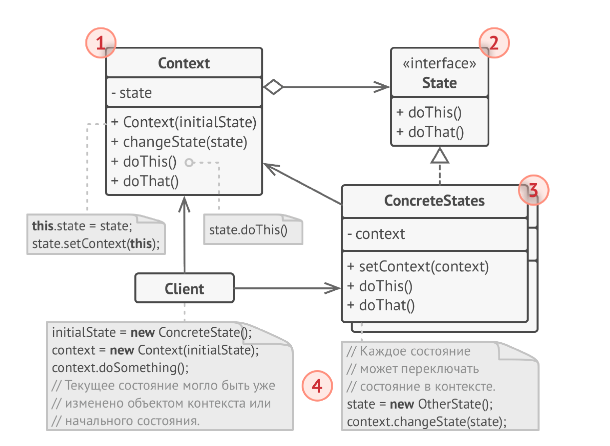

# Состояние
**Состояние** (***State***) — это поведенческий паттерн проектирования,
который позволяет объектам менять поведение в
зависимости от своего состояния. Извне создаётся
впечатление, что изменился класс объекта.

## Проблема
1) Сложная логика условных операторов: Без паттерна Состояние, управление переходами между различными состояниями объекта часто осуществляется с помощью больших и запутанных блоков if-else if-else или switch-case. Это делает код нечитаемым, трудно поддерживаемым и подверженным ошибкам, особенно при увеличении количества состояний.

2) Нарушение принципа единственной ответственности: Один класс отвечает за слишком много логики, связанной с различными состояниями. Это делает класс громоздким и затрудняет его тестирование и изменение.

3) Трудно добавить новые состояния: Добавление нового состояния требует изменения исходного класса, что может привести к ошибкам и нарушению существующей функциональности.

4) Неясная структура кода: Код становится запутанным и трудным для понимания, потому что логика, связанная с каждым состоянием, разбросана по всему классу.

5) Трудно отладить: Сложная логика условных операторов затрудняет отладку и поиск ошибок.

6) Повтор кода: Часто похожая логика дублируется в разных ветках условных операторов, что ухудшает поддерживаемость и приводит к несогласованности.

## Решение
1) Сложная логика условных операторов: Паттерн устраняет необходимость в больших блоках if-else или switch-case. Логика каждого состояния инкапсулируется в отдельном классе, что делает код более чистым и понятным.

2) Нарушение принципа единственной ответственности: Каждое состояние получает свой собственный класс, что соответствует принципу единственной ответственности. Каждый класс отвечает только за логику, связанную с конкретным состоянием.

3) Трудно добавить новые состояния: Добавление нового состояния сводится к созданию нового класса, реализующего интерфейс состояния. Существующий код не нужно менять, что повышает стабильность и снижает риск ошибок.

4) Неясная структура кода: Код становится более организованным и понятным, поскольку логика каждого состояния находится в отдельном классе. Это повышает читаемость и поддерживаемость.

5) Трудно отладить: Отладка становится проще, поскольку код для каждого состояния изолирован и легко тестируется.

6) Повтор кода: Поскольку логика каждого состояния находится в отдельном классе, повтор кода сводится к минимуму.

## Структура

1. Контекст хранит ссылку на объект состояния и делегирует
   ему работу, зависящую от внутреннего состояния. Контекст
   работает с этим объектом через общий интерфейс
   состояний. Контекст должен иметь метод для присваивания
   ему ныового объекта-состояния.
2. Состояние описывает общий интерфейс для всех
   конкретных состояний.
3. Конкретные состояния реализуют поведения, связанные с
   определённым состоянием контекста. Иногда приходится
   создавать целые иерархии классов состояний, чтобы
   обобщить дублирующий код.
   Состояние может иметь обратную ссылку на объект
   контекста. Через неё не только удобно получать из
   контекста нужную информацию, но и осуществлять смену
   его состояния.
4. И контекст, и объекты конкретных состояний могут решать,
   когда и какое следующее состояние будет выбрано. Чтобы
   переключить состояние, нужно подать другой объект-
   состояние в контекст.

## Примеры
### Аналогия из жизни
Ваш смартфон ведёт себя по-разному, в зависимости от
текущего состояния:
* Когда телефон разблокирован, нажатие кнопок телефона
приводит к каким-то действиям.
* Когда телефон заблокирован, нажатие кнопок приводит к
экрану разблокировки.
* Когда телефон разряжен, нажатие кнопок приводит к
экрану зарядки.

### Данный пример
Имитация работы светофора.

### Из JDK
1) java.util.concurrent.locks.ReentrantLock: Хотя не является прямой реализацией паттерна "Состояние", ReentrantLock управляет различными состояниями (заблокирован, разблокирован, попытка захвата и т.д.). Внутренняя логика управляет переходами между этими состояниями в зависимости от вызовов методов lock(), unlock(), и т.д.

2) Потоки (java.lang.Thread): Жизненный цикл потока (NEW, RUNNABLE, BLOCKED, WAITING, TIMED_WAITING, TERMINATED) можно рассматривать как пример применения принципов паттерна "Состояние". Внутренняя реализация JVM переводит поток между этими состояниями в зависимости от его выполнения и взаимодействий с другими потоками и ресурсами. Однако доступ к этим состояниям не через явный интерфейс "состояния", а через методы вроде getState().

