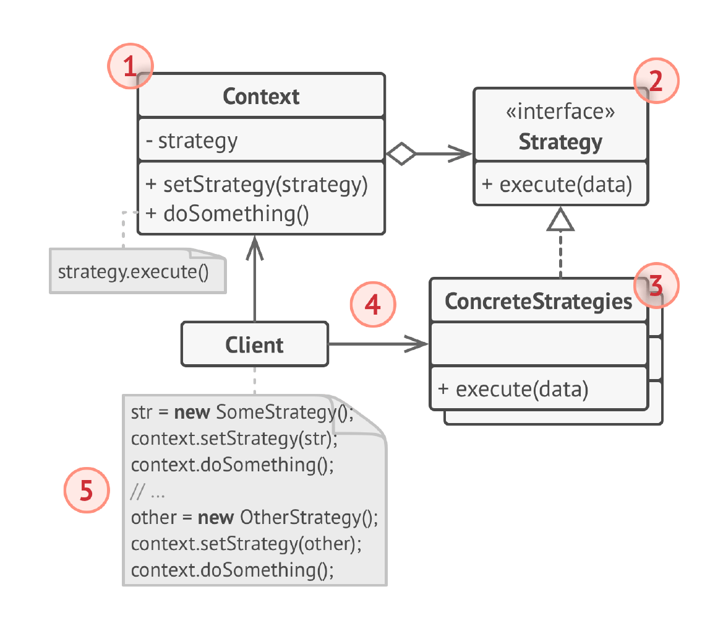

# Стратегия
**Стратегия** (***Strategy***) - это поведенческий паттерн проектирования, который определяет семейство схожих 
алгоритмов и помещает каждый из них в собственный класс. После чего, алгоритмы можно взаимозаменять прямо во время 
исполнения программы.

## Проблема
1) Жесткая зависимость от алгоритмов: Код, использующий множество условных операторов для выбора алгоритма, становится 
жестко связанным с этими алгоритмами. Изменение или добавление нового алгоритма требует изменения самого кода, что 
затрудняет поддержку и расширение.

2) Дублирование кода: Если один и тот же алгоритм используется в разных частях приложения, но с небольшими вариациями, 
это может привести к дублированию кода.

3) Сложность поддержки и развития: Код с множеством условных операторов, отвечающих за выбор алгоритма, становится 
сложным для понимания, поддержки и отладки. Добавление новых функций или алгоритмов становится затруднительным.

4) Нарушение принципа открытости/закрытости: Код должен быть открыт для расширения, но закрыт для модификации. 
Использование условных операторов для выбора алгоритма нарушает этот принцип, так как добавление нового алгоритма 
требует изменения существующего кода.

## Решение
Паттерн Стратегия предлагает определить семейство схожих алгоритмов, которые часто изменяются или расширяются, и вынести
их в собственные классы, называемые стратегиями. Вместо того чтобы изначальный класс сам выполнял тот или иной алгоритм,
он будет отыгрывать роль контекста, ссылаясь на одну из стратегий и делегируя ей выполнение работы. А для смены
алгоритма будет достаточно подставить в контекст другой объект-стратегию.

## Структура

1) Контекст хранит ссылку на объект конкретной стратегии, работая с ним объектом через общий интерфейс стратегий.
2) Стратегия определяет интерфейс, общий для всех вариаций алгоритма. Контекст использует этот интерфейс для вызова 
алгоритма. Для контекста не важно, какая именно вариация алгоритма будет выбрана, так как все они имеют одинаковый
интерфейс.
3) Конкретные стратегии реализуют различные вариации алгоритма. 
4) Во время выполнения программы, контекст получает вызовы от клиента и делегирует их объекту конкретной стратегии. 
5) Обычно, клиент должен создать объект конкретной стратегии и передать его в контекст: либо через конструктор, либо в 
какой-то другой решающий момент, используя сеттер. Благодаря этому, контекст не знает о том, какая именно стратегия 
сейчас выбрана.

## Примеры
### Аналогия из жизни
Вам нужно добраться до аэропорта. Можно доехать на автобусе, такси или велосипеде. Здесь вид транспорта является
стратегией. Вы выбираете конкретную стратегию в зависимости от контекста (например, наличия денег или времени до отлёта
).

### Данный пример
В этом примере клиент создаёт заказ и выбирает динамически как он будет доставляться (нужную стратегию).

### Из JDK
1) java.util.Comparator: Интерфейс Comparator определяет стратегию сравнения объектов. Различные реализации Comparator
   предоставляют разные алгоритмы сортировки (например, по возрастанию, по убыванию, по определенному полю объекта). Классы
   Collections.sort() и Arrays.sort() принимают Comparator в качестве аргумента, что позволяет использовать разные
   стратегии сортировки.
2) java.util.concurrent.Executor: Интерфейс Executor и его подтипы (например, ThreadPoolExecutor) определяют стратегию
   выполнения задач. Различные реализации Executor предоставляют разные способы управления потоками и выполнения задач
   (например, создание нового потока для каждой задачи, использование пула потоков, планирование задач).
3) java.sql.DriverManager и java.sql.Driver: DriverManager использует Driver для подключения к базе данных.
   Различные реализации Driver предоставляют стратегии подключения к различным типам баз данных (MySQL, PostgreSQL, Oracle
   и т.д.).
### Дополнительно
Также можно привести пример с навигатором и разными стратегиями пути (пешком, на автобусе, на автомобиле и т.д.).
