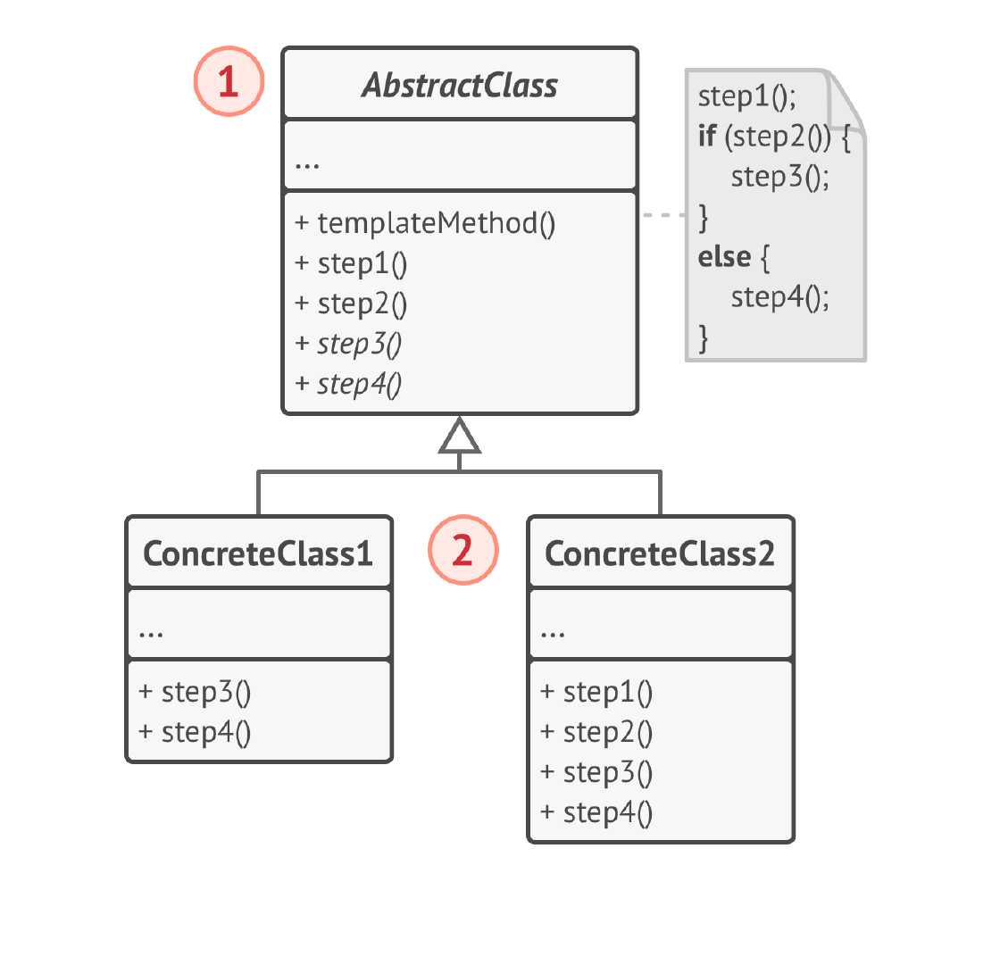

# Шаблонный метод
**Шаблонный метод** (***Template Method***) — это поведенческий паттерн
проектирования, который определяет скелет алгоритма,
перекладывая ответственность за некоторые его шаги на
подклассы. Паттерн позволяет подклассам переопределять
шаги алгоритма, не меняя его общей структуры.

## Проблема
1) Дублирование кода: Если несколько алгоритмов имеют общую структуру, но отличаются в некоторых шагах, это может привести к дублированию кода.

2) Расширение алгоритма: Изменение или расширение алгоритма может быть сложным, если его логика разбросана по нескольким классам.

3) Определение инвариантной части алгоритма: Необходимо определить общую, неизменяемую часть алгоритма, которая будет одинаковой для всех его вариаций.

4) Управление порядком выполнения шагов алгоритма: Необходимо контролировать порядок выполнения шагов алгоритма, чтобы гарантировать его корректную работу.

5) Нарушение принципа открытости/закрытости: Изменение алгоритма может потребовать изменения клиентского кода.

## Решение
Паттерн Шаблонный метод предлагает разбить алгоритм на
последовательность шагов, описать шаги в отдельных
методах и вызывать их в одном «шаблонном» методе друг
за другом.

Это позволит подклассам переопределять некоторые шаги
алгоритма, оставляя без изменений его структуру и
остальные шаги, которые для этого подкласса не так важны.

## Структура

1. Абстрактный класс определяет шаги алгоритма и содержит
   шаблонный метод, состоящий из вызовов этих шагов. Шаги
   могут быть как абстрактными, так и содержать реализацию
   по умолчанию.
2. Конкретный класс переопределяет некоторые (или все)
   шаги алгоритма. Конкретные классы не переопределяют
   сам шаблонный метод.

## Примеры
### Аналогия из жизни
Строители используют подход, похожий на шаблонный
метод при строительстве типовых домов. У них есть
основной архитектурный проект, в котором расписаны шаги
строительства — заливка фундамента, постройка стен,
постановка крыши, установка окон, обивка и так далее.
Но, несмотря на стандартизацию каждого этапа, строители
могут делать небольшие изменения на любом из этапов,
чтобы сделать дом чуточку непохожим на другие.

### Данный пример
Небольшой пример с шаблоном приготовления горячего напитка (чай и кофе).

### Из JDK
java.util.AbstractList, java.util.AbstractSet, java.util.AbstractMap: Эти абстрактные классы определяют скелет для реализации списков, множеств и map соответственно. Они реализуют некоторые методы, основываясь на других методах, которые должны быть переопределены подклассами. 
