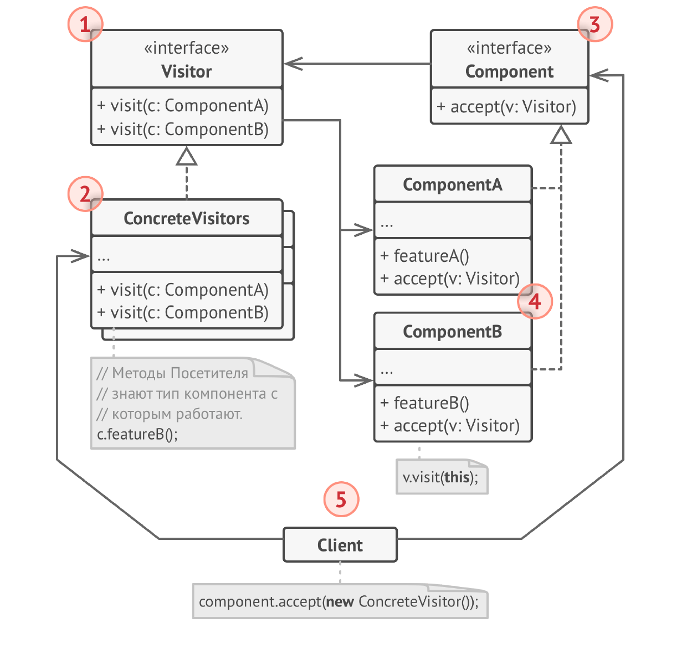

# Посетитель
**Посетитель** (***Visitor***) — это поведенческий паттерн проектирования,
который позволяет создавать новые операции, не меняя
классы объектов, над которыми эти операции могут
выполняться.

## Проблема
1) Модификация классов в иерархии: Добавление новой операции к каждому классу в иерархии требует изменения кода каждого класса. Это нарушает принцип открытости/закрытости и усложняет поддержку кода.

2) Распределение логики операции по нескольким классам: Логика новой операции может быть распределена по нескольким классам в иерархии, что усложняет ее понимание и изменение.

3) Зависимость от конкретных классов: Клиентский код, выполняющий операции над объектами иерархии, зависит от конкретных классов этой иерархии.

## Решение
1) Определение интерфейса посетителя: Создается интерфейс Visitor, который объявляет метод visit() для каждого класса в иерархии, которую нужно посетить. Каждый метод visit() принимает в качестве аргумента объект конкретного класса.

2) Реализация посетителей: Создаются конкретные классы, реализующие интерфейс Visitor. Каждый конкретный посетитель реализует логику определенной операции для каждого класса в иерархии.

3) Добавление метода accept() в иерархию: Каждый класс в иерархии должен иметь метод accept(), который принимает объект Visitor в качестве аргумента. Метод accept() вызывает соответствующий метод visit() посетителя, передавая себя в качестве аргумента. Это называется "двойной диспетчеризацией".

4) Вызов операций через посетителей: Клиентский код создает объект конкретного посетителя и передает его методу accept() объекта из иерархии. Метод accept() вызывает нужный метод visit() посетителя, который выполняет операцию над объектом.

## Структура

1. Посетитель описывает общий интерфейс для всех типов
   посетителей. Он объявляет набор методов, которые
   принимают различные классы компонентов в качестве
   параметров. В языках, поддерживающих перегрузку
   методов, эти методы могут иметь одинаковые имена, но
   типы их параметров должны отличаться.
2. Конкретные посетители реализуют какое-то особенное
   поведение для всех типов компонентов, которые можно
   подать через методы интерфейс посетителя.
3. Компонент описывает метод принятия посетителя. Этот
   метод должен иметь единственный параметр, объявленный
   с типом интерфейса посетителя.
4. Конкретные компоненты реализуют методы принятия
   посетителя. Цель этого метода — вызвать тот метод
   посещения, который соответствует типу этого компонента.
   Так посетитель узнает, с каким именно компонентом он
   работает.
5. Клиентом зачастую выступает коллекция или сложный
   составной объект (например, дерево Компоновщика).
   Клиент не знает конкретные классы своих компонентов.

## Примеры
### Аналогия из жизни
Представьте начинающего страхового агента, жаждущего
получить новых клиентов. Он беспорядочно посещает все
дома в округе, предлагая свои услуги. Но для каждого из
«типов» домов, которые он посещает, у него имеется
особое предложение.
* Придя в дом к обычной семье, он предлагает оформить
медицинскую страховку.
* Придя в банк, он предлагает страховку от грабежа.
* Придя на фабрику, он предлагает страховку предприятия от
пожара и наводнения.
