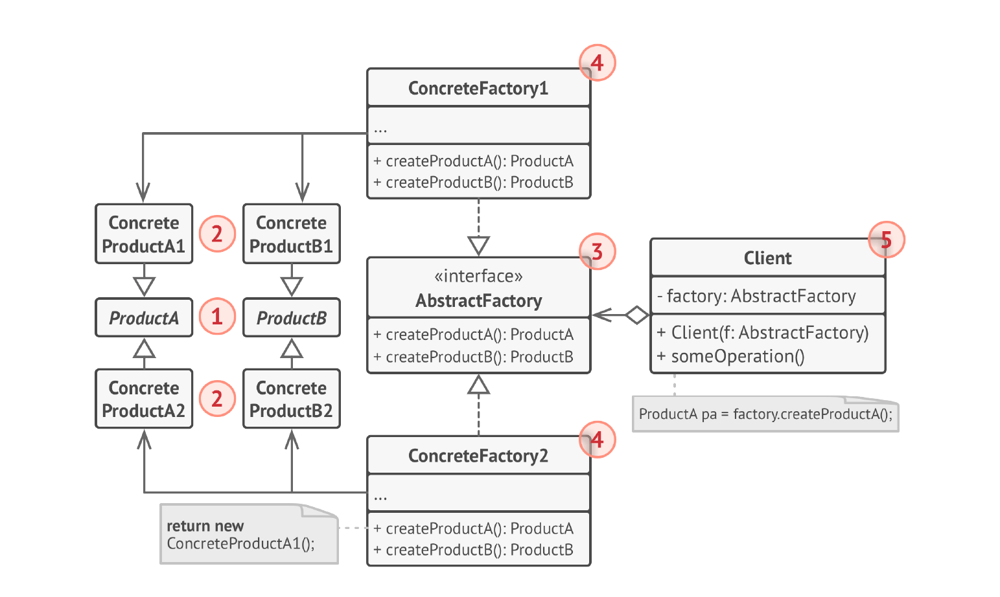
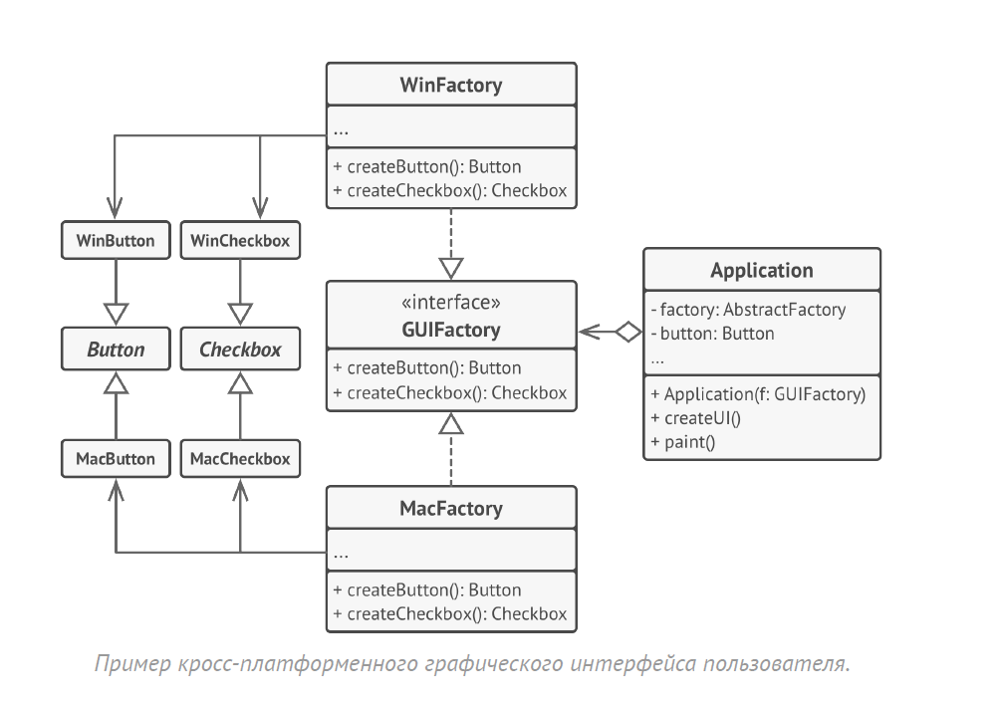

# Абстрактная фабрика
**Абстрактная фабрика** (***Abstract Factory***) — это порождающий паттерн проектирования, который позволяет создавать 
семейства связанных объектов, не привязываясь к конкретным классам создаваемых объектов.

## Проблема
1) Зависимость от конкретных классов продуктов: Клиентский код жестко связан с конкретными классами создаваемых объектов,
что затрудняет изменение реализации или добавление новых типов объектов.

2) Сложность создания семейств связанных объектов: Создание объектов, которые должны работать вместе, становится сложным,
если каждый объект создается независимо. Нет гарантии совместимости объектов.

3) Затруднительное переключение между семействами объектов: Изменение используемого семейства объектов требует изменения
клиентского кода.

4) Нарушение принципа открытости/закрытости: Добавление новых семейств объектов требует изменения существующего 
клиентского кода.

5) Дублирование кода: Если логика создания объектов для разных семейств похожа, это может привести к дублированию кода.

## Решение
Для начала, паттерн Абстрактная фабрика предлагает
выделить общие интерфейсы для отдельных продуктов,
составляющих семейства.

Далее, вы создаёте «абстрактную фабрику» — общий
интерфейс, который содержит методы создания всех
продуктов семейства. Для каждой вариации
семейства продуктов мы должны создать свою собственную
фабрику, реализовав абстрактный интерфейс. Фабрики
создают продукты одной вариации.

Клиентский код должен работать как с фабриками, так и с
продуктами только через их общие интерфейсы. Это
позволит подавать в ваши классы любой тип фабрики и
производить любые продукты, ничего не ломая.

## Структура

1. Абстрактные продукты объявляют интерфейсы продуктов,
   которые связаны друг с другом по смыслу, но выполняют
   разные функции.
2. Конкретные продукты — большой набор классов, которые
   относятся к различным абстрактным продуктам, но имеют одни и те же вариации.
3. Абстрактная фабрика объявляет методы создания
   различных абстрактных продуктов.
4. Конкретные фабрики относятся каждая к своей вариации
   продуктов и реализуют методы
   абстрактной фабрики, позволяя создавать все продукты
   определённой вариации.
5. Несмотря на то, что конкретные фабрики порождают
   конкретные продукты, сигнатуры их методов должны
   возвращать соответствующие абстрактные продукты. Это
   позволит клиентскому коду, использующему фабрику, не
   привязываться к конкретным классам продуктов. Клиент
   сможет работать с любыми вариациями продуктов через
   абстрактные интерфейсы.

## Примеры
### Данный пример
Представим, что у нас есть мебельная фабрика, которая производит
кресла, диваны и столы. У всех этих продуктов есть свой стиль для каждого:
арт-деко, модерн и викторианский. Пользователь в зависимости от фабрики создаёт 
необходимый продукт нужного стиля.
### Дополнительно
Ещё один интересный пример:

В этом примере Абстрактная фабрика создаёт кросс-платформенные элементы интерфейса и следит за тем,
чтобы они соответствовали выбранной операционной
системе.
