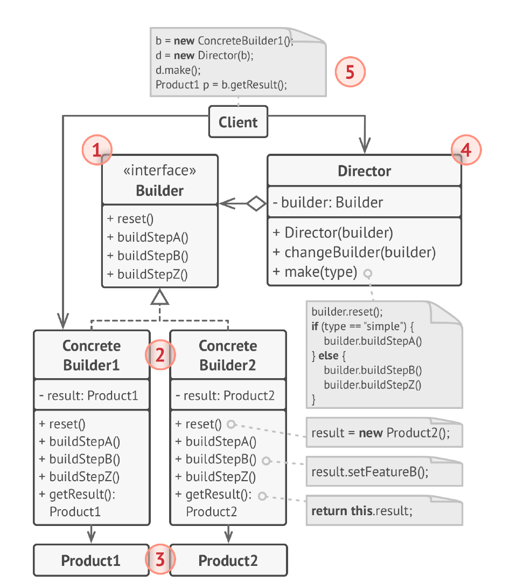
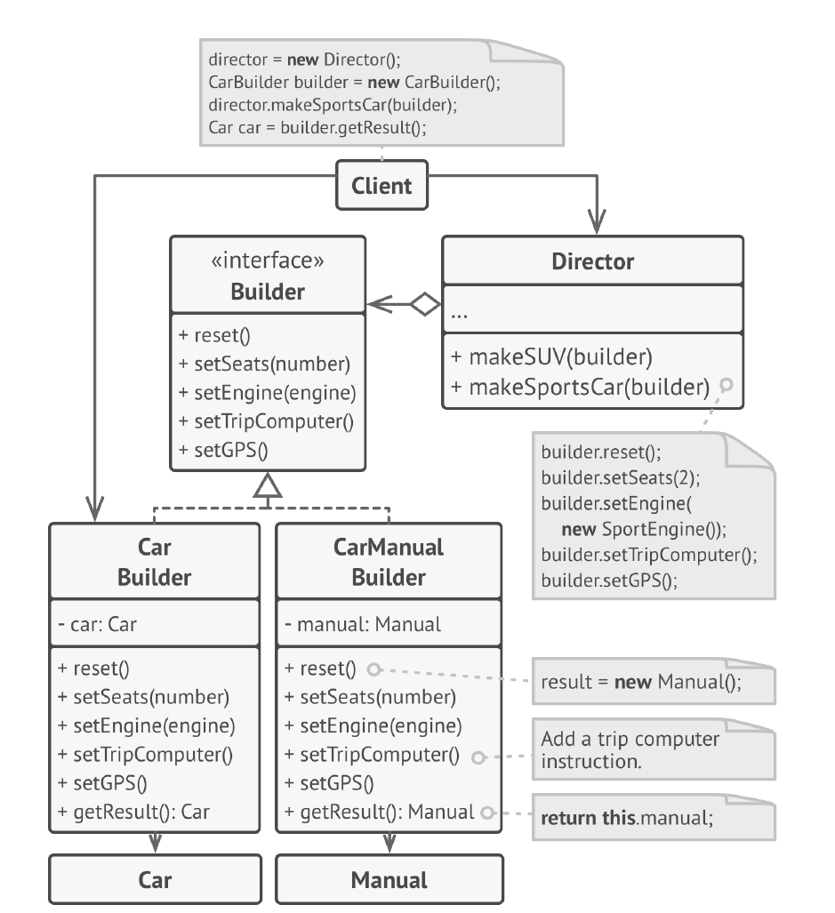

# Строитель
**Строитель** (***Builder***) — это порождающий паттерн проектирования,
который позволяет создавать сложные объекты пошагово.
Строитель даёт возможность использовать один и тот же
код строительства для получения разных представлений
объектов.

## Проблема
1) Большое количество параметров конструктора: Когда у объекта много параметров, особенно необязательных, конструктор 
становится громоздким и неудобным в использовании. Передача большого количества аргументов может привести к ошибкам и 
усложнить понимание кода.

2) Неизменяемость объекта: Если объект должен быть неизменяемым (immutable) после создания, его инициализация с помощью 
конструктора может быть сложной, особенно если нужно установить значения многих полей.

3) Различные представления объекта: Когда нужно создавать объект с разными конфигурациями или представлениями, 
использование одного конструктора может быть недостаточно гибким.

4) Сложная логика создания: Создание объекта может включать в себя несколько шагов и зависимостей, что усложняет 
конструктор и делает его менее понятным. Отделение логики создания от самого объекта улучшает читаемость кода.

5) Телескопический конструктор: Попытка решить проблему большого количества параметров путем создания нескольких 
конструкторов с разным количеством параметров (телескопический конструктор) приводит к дублированию кода и усложняет 
поддержку.

## Решение
Паттерн Строитель предлагает вынести конструирование
объекта за пределы его собственного класса, поручив это
дело отдельным объектам, называемым строителями.

Паттерн предлагает разбить процесс конструирования
объекта на отдельные шаги. Чтобы создать объект, вам нужно
поочерёдно вызывать методы строителя. Причём не нужно
запускать все шаги, а только те, что нужны для
производства объекта определённой конфигурации.

## Структура

1. Интерфейс строителя объявляет шаги конструирования
   продуктов, общие для всех видов строителей.
2. Конкретные строители реализуют строительные шаги,
   каждый по-своему. Конкретные строители могут
   производить разнородные объекты, не имеющие общего
   интерфейса.
3. Продукт — создаваемый объект. Продукты, сделанные
   разными строителями, не обязаны иметь общий интерфейс.
4. Директор определяет порядок вызова строительных шагов
   для производства той или иной конфигурации объектов.
5. Обычно, Клиент подаёт в конструктор директора уже
   готовый объект-строитель, и в дальнейшем данный
   директор использует только его. Но возможен и другой
   вариант, когда клиент передаёт строителя через параметр
   строительного метода директора. В этом случае можно
   каждый раз применять разных строителей для
   производства различных представлений объектов.

## Примеры
### Данный пример
Вот его схема:

### Из JDK
StringBuilder и StringBuffer: Эти классы позволяют пошагово конструировать строки, добавляя символы и строки с помощью 
методов append(). Финальная строка получается вызовом метода toString(). Это близко к концепции Builder, хотя и не 
является его полной реализацией.