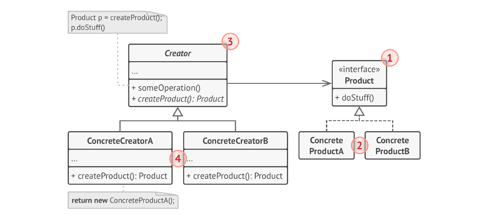

# Фабичный метод.
**Фабричный метод** (***Factory Method***) — это порождающий паттерн проектирования, который определяет общий интерфейс для 
создания объектов в суперклассе, позволяя подклассам изменять тип создаваемых объектов.

## Проблема
1) Клиентский код может быть жестко связан с конкретными классами создаваемых объектов. Это затрудняет изменение 
реализации или добавление новых типов объектов.
2) Если клиентский код зависит от конкретных классов, то добавление новых типов объектов потребует изменения клиентского
кода, что нарушает принцип открытости/закрытости.
3) Создание некоторых объектов может быть сложным и требовать множества шагов. Фабричный метод может инкапсулировать эту
логику создания.

## Решение
Паттерн Фабричный метод предлагает создавать объекты не напрямую, используя оператор new, а через вызов особого 
__фабричного метода__. Теперь вы сможете переопределить фабричный метод в подклассе, чтобы изменить тип создаваемого 
продукта. Чтобы эта система работала, все возвращаемые объекты должны иметь общий интерфейс. Подклассы смогут 
производить объекты различных классов, следующих одному и тому же интерфейсу.

## Структура


1) Продукт определяет общий интерфейс объектов, которые может произвести создатель и его подклассы.
2) Конкретные продукты содержат код различных продуктов. Продукты будут отличаться реализацией, но интерфейс у них будет
общий.
3) Создатель объявляет фабричный метод, создающий объекты через общий интерфейс продуктов. Зачастую фабричный метод 
объявляют абстрактным, чтобы заставить все подклассы реализовать фабричный метод по-своему. Однако он может возвращать и
какой-то продукт по умолчанию. Несмотря на название, важно понимать, что создание продуктов не является единственной и 
главной функцией создателя. Обычно он содержит и другой полезный код работы с продуктом.
4) Конкретные создатели по-своему реализуют фабричный метод, производя те или иные конкретные продукты. Фабричный метод 
не обязан всё время создавать новые объекты. Его можно переписать так, чтобы возвращать существующие объекты из 
какого-то хранилища или кэша.

## Примеры
### Данный пример
В примере мы рассматриваем кроссплатформенный диалог. У нас есть две кнопки: windows и html. Для них мы определяем общий
интерфейс Button. Клиент создаёт диалог, опираясь на операционную систему машины. Затем он рендерит окно, а для этого мы
создаём соответствующую кнопку.
### Из JDK
java.nio.charset.Charset#forName(): Этот метод возвращает объект Charset для заданной кодировки символов. Он действует 
как фабрика, создавая объекты Charset разных типов в зависимости от входного параметра.
### Дополнительно
Интересно заметить, что это может быть и что-то очень лёгкое.
```java
interface Pizza{}

class PepperoniPizza implements Pizza{}

class GreekPizza implements Pizza {}

class PizzaFactory {
    public static Pizza makePizza (String type) throws Exception {
        type = type.toLowerCase();
        
        switch (type){
           case "pepperoni" -> {return new Pepperoni();}
           case "greek" -> {return new GreekPizza();}
            default -> throw new Exception("New type of pizza!");
        }
    }
}

public class Main{
    public static void main(String[] args) {
        Pizza = PizzaFactory.makePizza("greek");
    }
}
```