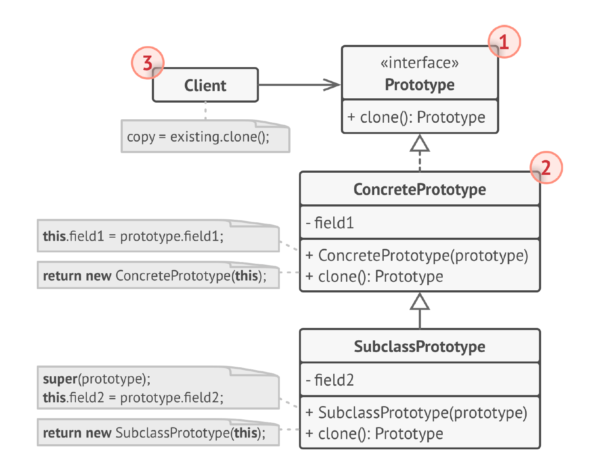

# Прототип
**Прототип** (***Prototype***) — это порождающий паттерн проектирования,
который позволяет копировать объекты, не вдаваясь в
подробности их реализации.

## Проблема
У вас есть объект, который нужно скопировать. Как это
сделать? Нужно создать пустой объект такого же класса, а
затем поочерёдно скопировать значения всех полей из
старого объекта в новый.

Прекрасно! Но есть нюанс. Не каждый объект удастся
скопировать таким образом, ведь часть его состояния
может быть приватной и недоступна для остального кода
программы.

Но есть и другая проблема. Копирующий код станет
зависим от классов копируемых объектов. Ведь чтобы 
перебрать все поля объекта, нужно привязаться к его
классу. Из-за этого вы не сможете копировать объекты, зная
только их интерфейсы, но не конкретные классы.

## Решение
Паттерн Прототип поручает создание копий самим
копируемым объектам. Он вводит общий интерфейс для
всех объектов, поддерживающих клонирование. Это
позволяет копировать объекты, не привязываясь к их
конкретным классам. Обычно такой интерфейс имеет всего
один метод clone.

Реализация этого метода в разных классах очень схожа.
Метод создаёт новый объект текущего класса и копирует в
него значения всех полей объекта. Так получится
скопировать даже приватные поля, так как большинство
языков программирования разрешает доступ к приватным
полям отдельного объекта текущего класса.

## Структура

1. Интерфейс прототипов описывает операции клонирования.
   В большинстве случаев — это единственный метод clone.
2. Конкретный прототип реализует операцию клонирования
   самого себя. Помимо банального копирования значений
   всех полей, здесь могут быть спрятаны различные
   сложности, о которых не нужно знать клиенту. Например,
   клонирование связанных объектов, распутывание
   рекурсивных зависимостей и прочее.
3. Клиент создаёт копию объекта, обращаясь к нему через
   общий интерфейс прототипов.

## Примеры
### Аналогия из жизни
Деление клеток. После митозного деления клеток образуются две
совершенно идентичные клетки. Оригинальная клетка
отыгрывает роль прототипа, принимает активную роль в
создании нового объекта.

### Данный пример
Представим, что у нас есть массив Фигур, в котором разные круги и треугольники. 
Нужно получить копию этого массива.

### Из JDK
java.lang.Object#clone(): Метод clone() предназначен для создания копии объекта. Это напоминает Прототип, но clone() 
имеет свои особенности и ограничения:
1) Cloneable interface: Для корректной работы clone() класс должен реализовывать маркерный интерфейс Cloneable. Иначе 
будет выброшено исключение CloneNotSupportedException.

2) Поверхностное копирование: По умолчанию, clone() выполняет поверхностное копирование (shallow copy). Если объект 
содержит ссылки на другие объекты, то в копии будут сохранены те же ссылки, а не копии объектов. Для глубокого 
копирования (deep copy) нужно переопределить метод clone().