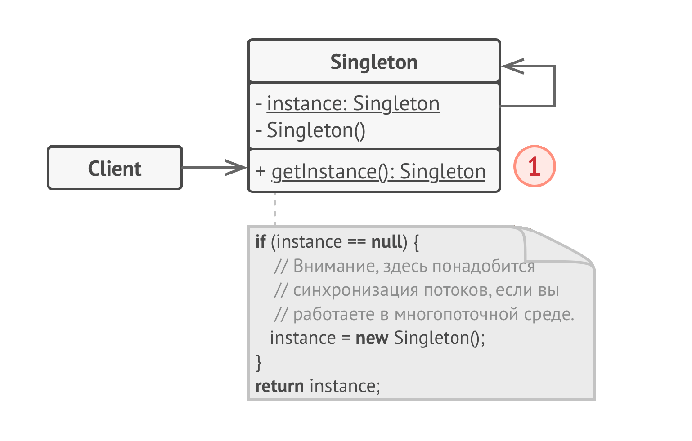

# Одиночка
**Одиночка** (***Singleton***) - это порождающий паттерн проектирования, который гарантирует, что у класса есть только 
один экземпляр, и предоставляет к нему глобальную точку доступа.

## Проблема
1) Представьте, что вы создали объект, а через некоторое время, пробуете создать ещё один. В этом случае, хотелось бы
   получить старый объект, вместо создания нового. Чаще всего это полезно для доступа к какому-то общему ресурсу, например,
   базе данных.
2) Неплохо бы хранить в одном месте и код, который решает проблему №1, а также иметь к нему простой и доступный
   интерфейс.

## Решение
Все реализации одиночки сводятся к тому, чтобы скрыть конструктор по умолчанию и создать публичный статический метод,
который и будет контролировать жизненный цикл объекта-одиночки. Если у вас есть доступ к классу-одиночке, значит, будет
доступ и к этому статическому методу. Из какой точки кода вы бы его не вызвали, он всегда будет отдавать один и тот же
объект.

## Структура

Одиночка определяет статический метод getInstance(), который возвращает единственный экземпляр своего класса. 
Конструктор должен быть скрыт, ссылка на себя также должна быть скрыта.
## Примеры
### Аналогия из жизни
Правительство государства — хороший пример одиночки. В государстве может быть только одно официальное правительство. Вне
зависимости от того, кто конкретно заседает в правительстве, оно имеет глобальную точку доступа «Правительство страны N».
### Данный пример
Одиночкой выступает база данных, к которой мы обращаемся с запросами.
### Из JDK
1) java.lang.Runtime: Класс Runtime предоставляет доступ к среде выполнения Java. Метод Runtime.getRuntime() возвращает
   единственный экземпляр класса Runtime. Это классический пример Singleton.
2) java.awt.Desktop: Класс Desktop предоставляет доступ к функциям рабочего стола, таким как открытие файлов и
   URL-адресов в приложениях по умолчанию. Метод Desktop.getDesktop() возвращает единственный экземпляр класса Desktop.
3) java.lang.System: Класс System предоставляет доступ к системным ресурсам, таким как стандартный ввод/вывод и
   переменные окружения. Хотя System не является Singleton в строгом смысле (у него нет приватного конструктора, и вы не
   можете создать экземпляр напрямую), он предоставляет статические методы для доступа к своим функциям, что функционально
   похоже на Singleton.
### Дополнительно
1) Если мы имеем дело с не многопоточной средой, то можно использовать классическую версию Singleton.java.
2) Если же у нас многопоточная среда, то можно сделать метод synchronized в Singleton2.java. Вряд ли это будет удобно,
   так как при каждом вызове синхронизированный метод будет "уничтожать" всю многопоточность, то есть это не лучший
   вариант.
3) В Singleton3.java я предлагаю сразу инициализировать переменную и она будет инициализирована до того, как любой поток
   войдет в метод. Иногда это лучшее решение.
4) Ну и наконец в Singleton4.java мы реализуем "ленивую инициализацию", то есть инициализацию при первом вызове. Она
   потокобезопасна и быстра. Часто это лучшее решение.
