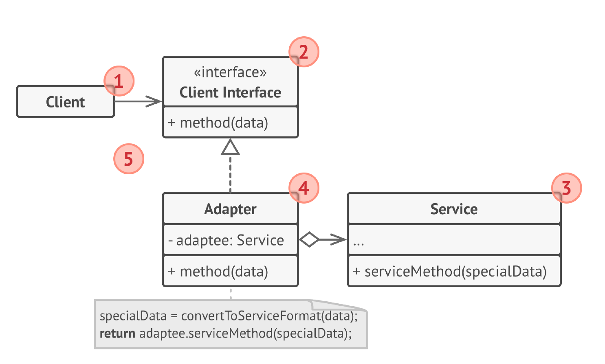
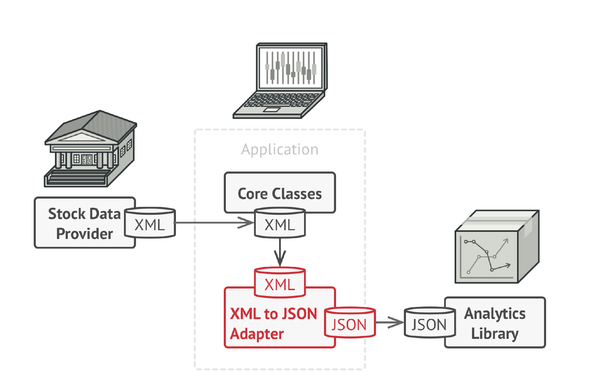

# Адаптер
**Адаптер** (***Adapter***) — это структурный паттерн проектирования,
который позволяет объектам с несовместимыми
интерфейсами работать вместе.

## Проблема
1) Использование существующего класса с несовместимым интерфейсом: У вас есть класс, который предоставляет нужную 
функциональность, но его интерфейс несовместим с интерфейсом, ожидаемым клиентским кодом.

2) Интеграция классов с разными интерфейсами: Необходимо использовать несколько классов с разными интерфейсами, которые не 
могут взаимодействовать напрямую.

3) Изменение интерфейса класса без изменения его кода: Требуется изменить интерфейс существующего класса, но изменение его 
исходного кода невозможно или нежелательно.

4) Обеспечение совместимости между классами с изменяющимися интерфейсами: Интерфейсы классов могут меняться со временем. 
Адаптер позволяет изолировать клиентский код от этих изменений.

## Решение
Вы можете создать адаптер. Это объект-переводчик,
который трансформирует интерфейс или данные одного
объекта в такой вид, чтобы он стал понятен другому
объекту.

При этом адаптер оборачивает один из объектов, так что
другой объект даже не знает о его наличии. Например, вы
можете обернуть объект, работающий в метрах, адаптером,
который бы конвертировал данные в футы.

Адаптеры могут не только переводить данные из одного
формата в другой, но и помогать объектам с разными
интерфейсами работать сообща. Это работает так:
1. Адаптер следует интерфейсу, который один объект ожидает
   от другого.
2. Когда первый объект вызывает методы адаптера, адаптер
   передаёт выполнение второму объекту, вызывая в нём те
   или иные методы в том порядке, который важен для
   второго объекта.
   Иногда возможно создать даже двухсторонний адаптер,
   который работал бы в обе стороны.

## Структура

1. Клиент — это класс, который содержит существующую
   бизнес-логику программы.
2. Клиентский интерфейс описывает протокол, через который
   клиент может работать с другими классами.
3. Сервис – это какой-то полезный класс, обычно сторонний.
   Клиент не может использовать этот класс напрямую, так как
   сервис имеет непонятный ему интерфейс.
4. Адаптер — это класс, который может одновременно
   работать и с клиентом, и с сервисом. Он реализует
   клиентский интерфейс и содержит ссылку на объект
   сервиса. Адаптер получает вызовы от клиента через методы
   клиентского интерфейса, а затем переводит их в вызовы
   методов обёрнутого объекта в правильном формате.
5. Работая с адаптером через интерфейс, клиент не
   привязываться к конкретному классу адаптера. Благодаря
   этому, вы можете добавлять в программу новые виды
   адаптеров, независимо от клиентского кода. Это может
   пригодиться, если интерфейс сервиса вдруг изменится,
   например, после выхода новой версии сторонней
   библиотеки.

## Примеры
### Аналогия из жизни
Когда вы в первый раз летите за границу, вас может ждать
сюрприз при попытке зарядить ноутбук. Стандарты розеток
в разных странах отличаются.

Ваша европейская зарядка будет бесполезна в США без
специального адаптера, позволяющего подключиться к
розетке другого типа.

### Данный пример
В данном примере мы хотим нарисовать старый треугольник, но умеем рисовать только новые фигуры. 
Для этого используется адаптер.

### Дополнительно 
Вот ещё один пример:

