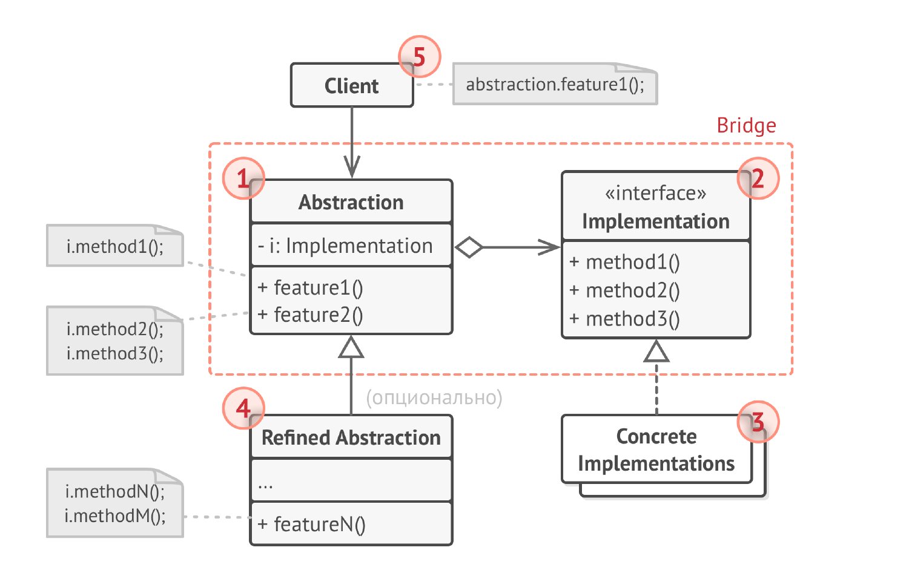
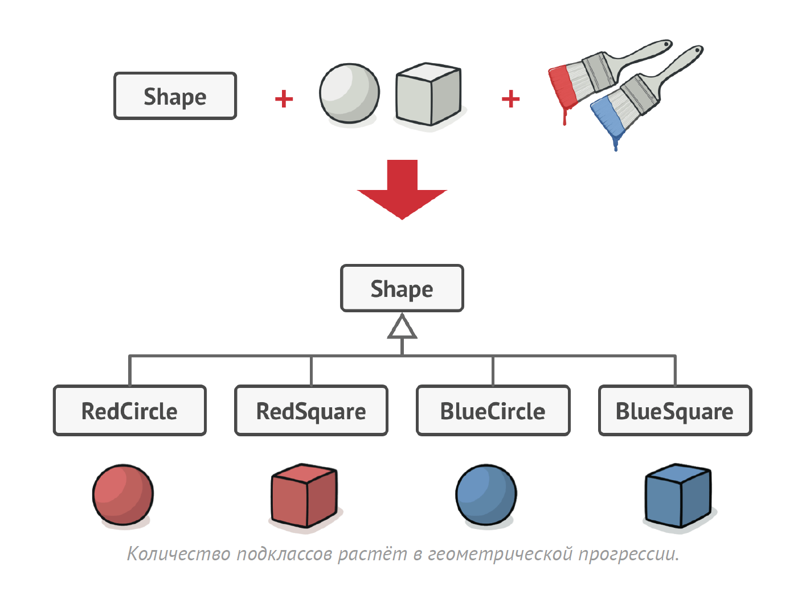
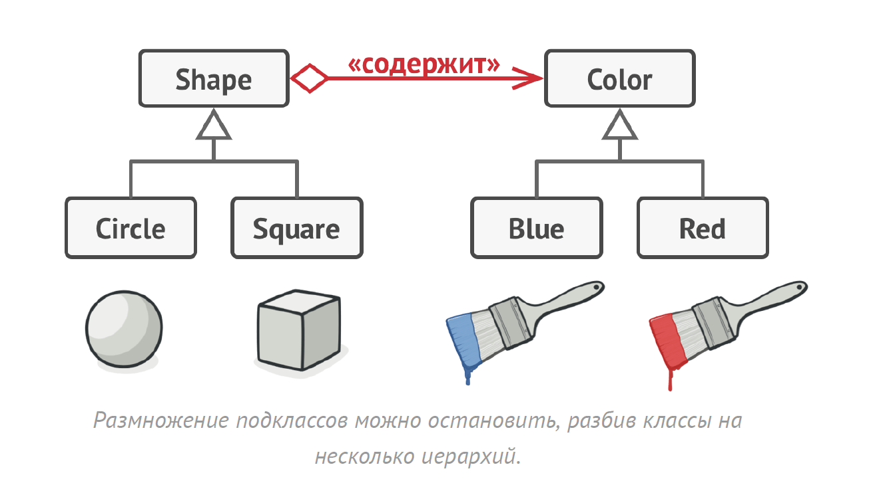

# Мост
**Мост** (***Bridge***) — это структурный паттерн проектирования, который
разделяет один или несколько классов на две отдельные
иерархии — абстракцию и реализацию, позволяя изменять
их независимо друг от друга.

## Проблема
1) Зависимость между абстракцией и реализацией: Изменения в реализации могут потребовать изменений в абстракции, и наоборот.
Это затрудняет поддержку, расширение и повторное использование кода.

2) Комбинаторный взрыв подклассов: Если абстракция и реализация представлены иерархиями классов, то добавление новых 
вариантов абстракции или реализации приводит к экспоненциальному росту числа подклассов.

3) Платформозависимость: Абстракция может быть жестко связана с конкретной платформой или операционной системой, что 
затрудняет перенос кода на другие платформы.

4) Затруднительное тестирование: Тестирование абстракции и реализации по отдельности затруднено, если они жестко связаны.

## Решение
Паттерн Мост предлагает заменить наследование
делегированием. Для этого нужно выделить одну из таких
«плоскостей» в отдельную иерархию и ссылаться на объект
этой иерархии, вместо хранения его состояния и поведения
внутри одного класса.

## Структура

1. Абстракция содержит управляющую логику. Код абстракции
   делегирует реальную работу связанному объекту
   реализации.
2. Реализация задаёт общий интерфейс для всех реализаций.
   Все методы, которые здесь описаны, будут доступны из
   класса абстракции и его подклассов.
   Интерфейсы абстракции и реализации могут как совпадать,
   так или быть совершенно разными. Но обычно, в
   реализации живут базовые операции, на которых строятся
   сложные операции абстракции.
3. Конкретные Реализации содержат платформо-зависимый
   код.
4. Расширенные Абстракции содержат различные вариации
   управляющей логики. Как и родитель, работает с
   реализациями только через общий интерфейс реализации.
5. Клиент работает только с объектами абстракции. Не считая
   первичного связывания абстракции с одной из реализаций,
   клиентский код не имеет прямого доступа к объектам
   реализации.

## Примеры
### Данный пример

И его решение:

### Из JDK
java.awt.AWT (частично): В AWT есть разделение между абстрактными классами компонентов (например, Component, Container) 
и их реализациями, которые зависят от платформы (peer classes). Например, Button — это абстрактный класс, а его 
конкретная реализация на Windows и Linux будет разной. Это напоминает Bridge, но peer classes скрыты и недоступны 
напрямую, что отличается от классической реализации Bridge.
