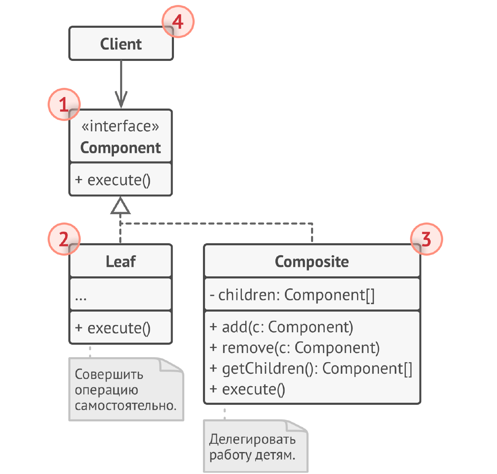
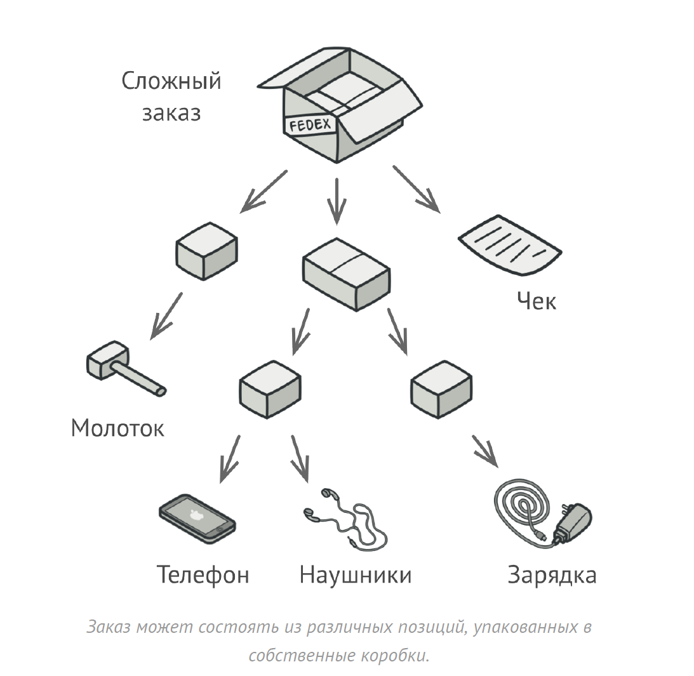

# Компоновщик
**Компоновщик** (***Composite***) — это структурный паттерн проектирования,
который позволяет сгруппировать объекты в древовидную
структуру, а затем работать с ними так, если бы это был
единичный объект.

## Проблема
1) Различие в обработке отдельных объектов и групп объектов: Клиентский код должен различать, работает ли он с отдельным 
объектом или с группой объектов, что усложняет код и делает его менее гибким.

2) Сложность добавления новых типов объектов в иерархию: Добавление новых типов объектов (листьев или составных объектов) 
в древовидную структуру может потребовать изменения клиентского кода.

3) Необходимость рекурсивного обхода дерева: Клиентский код часто вынужден реализовывать рекурсивный обход дерева для 
выполнения операций над всеми элементами.

4) Нарушение принципа открытости/закрытости: Добавление новых типов объектов в иерархию может потребовать изменения 
существующего клиентского кода.

## Решение
1) Единый интерфейс: Компоновщик определяет общий интерфейс как для отдельных объектов (листьев), так и для групп объектов 
(композитов). Этот интерфейс обычно содержит методы, которые могут быть применены как к отдельному объекту, так и к группе объектов. 

2) Прозрачность: Клиентский код работает с общим интерфейсом и не различает, обращается ли он к листу или к композиту.
Это упрощает код и делает его более гибким.

3) Рекурсивный обход: Логика рекурсивного обхода дерева инкапсулируется внутри композитных объектов. Клиентскому коду не 
нужно реализовывать рекурсию самостоятельно.

4) Добавление новых типов объектов: Добавление новых типов листьев или композитов не требует изменения клиентского кода, 
если они реализуют общий интерфейс. Это соответствует принципу открытости/закрытости.

## Структура

1. Компонент определяет общий интерфейс для простых и
   составных компонентов дерева.
2. Лист – это простой элемент дерева, не имеющий
   ответвлений.
   Из-за того, что им некому больше передавать выполнение,
   классы Листьев будут содержать большую часть полезного
   кода.
3. Контейнер (или «композит») — это составной элемент
   дерева. Он содержит набор дочерних компонентов, но
   ничего не знает об их типах. Это могут быть как простые
   компоненты-листья, так и другие компоненты-контейнеры.
   Но это не является проблемой, так как все дочерние
   элементы следуют общему интерфейсу.
   Методы контейнера переадресуют основную работу своим
   дочерним компонентам, хотя и могут добавлять что-то своё
   к результату.
4. Клиент работает с деревом через общий интерфейс
   компонентов.
   Благодаря этому, клиенту без разницы что перед ним
   находится — простой или составной компонент дерева.

## Примеры
### Аналогия из жизни
Армии большинства государств могут быть представлены в
виде перевёрнутых деревьев. На нижнем уровне у вас есть
солдаты, затем взводы, затем полки, а затем целые армии.
Приказы отдаются сверху и спускаются вниз по структуре
командования, пока не доходят до конкретного солдата.

### Данный пример
В данном примере у нас есть блюда, а также категории меню, которые включают в себя несколько
блюд. Нам нужен чек, легко представим это всё в виде дерева.

### Из JDK
1) java.awt.Container и java.awt.Component: Container (контейнер) может содержать другие Component (компоненты), включая 
другие контейнеры. Это формирует древовидную структуру, где Container действует как композитный объект, а отдельные 
компоненты (кнопки, текстовые поля и т.д.) — как листья. Методы, такие как paint(), рекурсивно вызываются на всех 
компонентах в контейнере.

2) javax.swing.JComponent и его подклассы: Аналогично AWT, JComponent и его подклассы в Swing образуют древовидную 
структуру, где контейнеры (например, JPanel) могут содержать другие компоненты.

3) java.io.File: File может представлять как файл, так и директорию. Директория, в свою очередь, может содержать другие 
файлы и директории. Методы, такие как listFiles(), позволяют работать с директориями как с группами файлов. Хотя это и 
не чистый Composite, здесь присутствует идея рекурсивной структуры.

### Дополнительно
Ещё пример:

