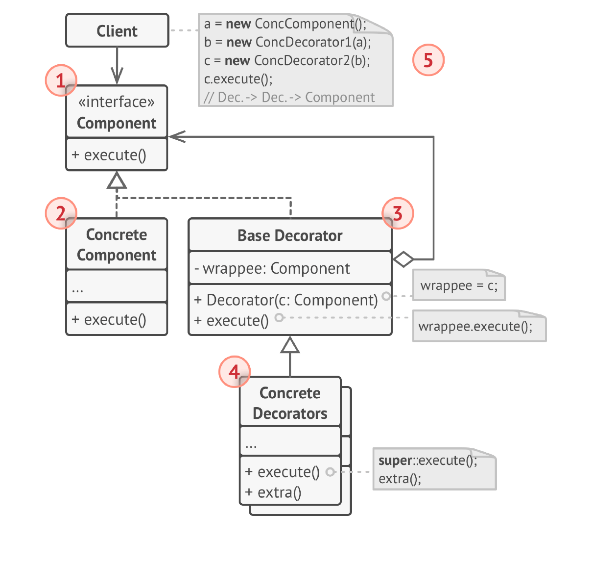

# Декоратор
**Декоратор** (***Decorator***) — это структурный паттерн проектирования,
который позволяет динамически добавлять объектам новую
функциональность, оборачивая их в полезные «обёртки».

## Проблема
1) Расширение функциональности класса без наследования: Добавление новой функциональности с помощью наследования приводит 
к большому количеству подклассов, особенно если нужно комбинировать разные функции. Это усложняет код и делает его менее
поддерживаемым.

2) Динамическое добавление обязанностей: Требуется добавлять обязанности к объекту во время выполнения, а не на этапе 
компиляции. Наследование не позволяет делать это динамически.

3) Избежание "загрязнения" класса множеством обязанностей: Класс не должен быть перегружен множеством различных обязанностей.
Декоратор позволяет разделять обязанности на отдельные классы.

4) Комбинирование различных обязанностей: Нужно иметь возможность комбинировать разные обязанности (функции) в любом порядке.
Наследование не предоставляет такой гибкости.

5) Нарушение принципа единственной ответственности (Single Responsibility Principle): Класс, выполняющий множество разных 
обязанностей, нарушает принцип единственной ответственности. Декоратор позволяет разделить обязанности на отдельные классы.

## Решение
Декоратор имеет альтернативное название — «обёртка».
Оно удачнее описывает суть паттерна: вы помещаете
целевой объект в другой объект-обёртку, который запускает
базовое поведение объекта, а затем добавляет к результату
что-то своё.

Оба объекта имеют общий интерфейс, поэтому для
пользователя нет никакой разницы с чем работать — с
чистым объектом или обёрнутым. Вы можете использовать
несколько разных обёрток одновременно — результат
будет иметь объединённое поведение всех обёрток сразу.

## Структура

1. Компонент задаёт общий интерфейс обёрток и
   оборачиваемых объектов.
2. Конкретный Компонент определяет класс оборачиваемых
   объектов. Он содержит какое-то базовое поведение,
   которое потом изменяют декораторы.
3. Базовый Декоратор хранит ссылку на вложенный объект-
   компонент. Им может быть как конкретный компонент, так и
   один из конкретных декораторов. Базовый декоратор
   делегирует все свои операции вложенному объекту.
   Дополнительное поведение будет жить в конкретных
   декораторах.
4. Конкретные Декораторы — это различные вариации
   декораторов, которые содержат добавочное поведение.
   Оно выполняется до или после вызова аналогичного
   поведения обёрнутого объекта.
5. Клиент может оборачивать простые компоненты и
   декораторы в другие декораторы, старясь работать со
   всему объектами через общий интерфейс компонентов.

## Примеры
### Аналогия из жизни
Любая одежда — это аналог декоратора. Применяя
декоратор, вы не меняете первоначальный класс и не
создаёте дочерних классов. Так и с одеждой — надевая
свитер, вы не перестаёте быть собой, но получаете новое
свойство — защиту от холода. Вы можете пойти дальше и
надеть сверху ещё один декоратор, плащ, чтобы защититься
и от дождя.

### Данный пример
В данном примере у нас есть круг который нужно отрисовать, к нему добавляется функциональность
красной границы и можно добавить текстуру, работает всё через оборачивание.

### Из JDK
1) Потоки ввода-вывода (java.io): Это классический пример Декоратора. Классы, такие как BufferedInputStream, DataInputStream,
FileInputStream и другие, оборачивают базовый поток ввода-вывода (InputStream) и добавляют к нему новую функциональность 
(буферизация, чтение разных типов данных). Все они реализуют интерфейс InputStream, что позволяет комбинировать декораторы.

2) Коллекции (java.util.Collections): Методы, такие как synchronizedCollection(), unmodifiableCollection() и другие, 
возвращают декораторы, которые добавляют к коллекции новую функциональность (синхронизация, неизменяемость).

