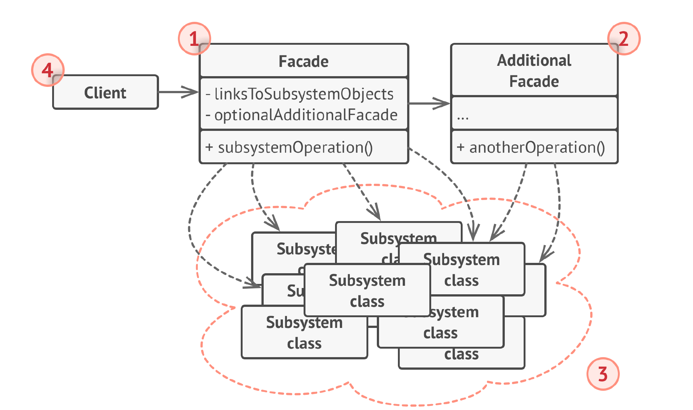

# Фасад
**Фасад** (***Facade***) — это структурный паттерн проектирования, который
предоставляет простой интерфейс к сложной системе
классов, библиотеке или фреймворку.

## Проблема
Вашему коду приходится работать с большим количеством
объектов некой сложной библиотеки или фреймворка. Вы
должны самостоятельно инициализировать эти объекты,
следить за правильным порядком зависимостей и так
далее.

В результате, бизнес-логика ваших классов тесно
переплетается с деталями реализации сторонних классов.
Такой код довольно сложно понимать и поддерживать.

## Решение
Фасад — это простой интерфейс работы со сложной
подсистемой, содержащей множество классов. Фасад может
иметь урезанный интерфейс, не имеющий 100%
функциональности, которую можно достичь, используя
сложную подсистему напрямую. Но он предоставляет
именно те фичи, которые нужны клиенту, и скрывает все
остальное.

Фасад полезен, если вы используете какую-то сложную
библиотеку с множеством подвижных частей, но вам нужна
только часть её возможностей.

## Структура

1. Фасад предоставляет быстрый доступ к определённой
   функциональности подсистемы. Он «знает», каким классам
   нужно переадресовать запрос, и какие данные для этого
   нужны.
2. Дополнительный фасад можно ввести, чтобы не захламлять
   единственный фасад разнородной функциональностью. Он
   может использоваться как клиентом, так и другими
   фасадами.
3. Сложная подсистема состоит из множества разнообразных
   классов. Для того чтобы заставить их что-то делать, нужно
   знать подробности устройства подсистемы, порядок
   инициализации объектов и так далее.
   Классы подсистемы не знают о существовании фасада и
   работают друг с другом напрямую.
4. Клиент использует фасад вместо прямой работы с
   объектами сложной подсистемы.

## Примеры
### Аналогия из жизни
Когда вы звоните в магазин и делаете заказ по телефону,
сотрудник службы поддержки является вашим фасадом ко
всем службам и отделам магазина. Он предоставляет вам
упрощённый интерфейс к системе создания заказа,
платёжной системе и отделу доставки.

### Из JDK
1) java.net.URL: Класс URL предоставляет упрощенный интерфейс для работы с сетевыми ресурсами. Он скрывает сложную 
логику работы с различными протоколами (HTTP, FTP и т.д.), соединениями и потоками данных.

2) java.lang.System: Класс System предоставляет доступ к различным системным функциям, таким как стандартный ввод/вывод,
переменные окружения и сборщик мусора. Он действует как фасад к более сложным системным механизмам.

### Дополнительно
Также можно привести пример с умным домом. Где мы, например, заходим домой и говорим включи телевизор.
У умного дома есть фасад (если сказали включи телевизор, то надо включить) и он прост для клиента, но 
скрывает внутреннюю сложность и подсистемы: включить свет в квартире, подключить колонки к телевизору, выставить 
последнюю громкость, включить телевизор, установить нужный канал и т.д.