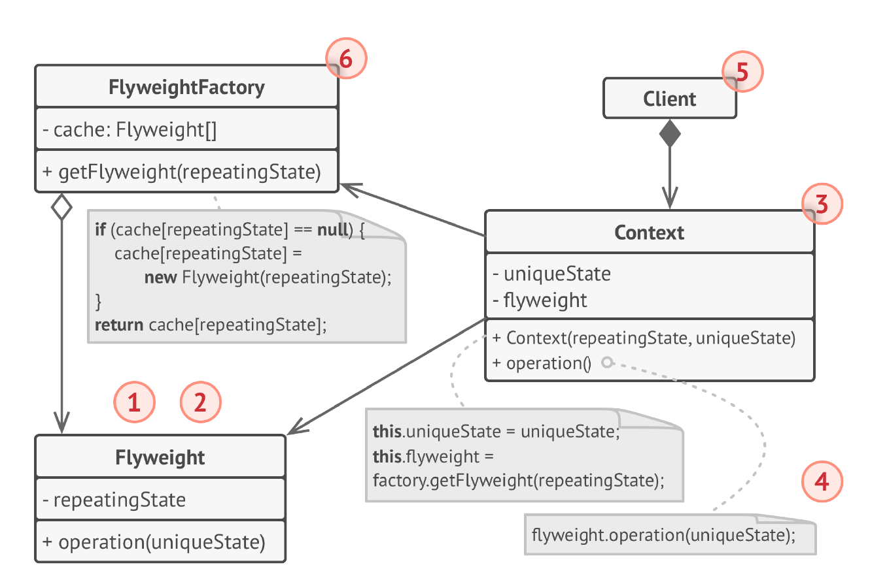
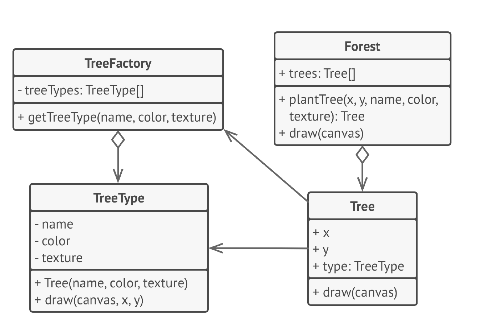

# Легковес
**Легковес** (***Flyweight***) — это структурный паттерн проектирования,
который позволяет вместить большее количество объектов
в отведённую оперативной память за счёт экономного
разделения общего состояния объектов между собой,
вместо хранения одинаковых данных в каждом объекте.

## Проблема
1) Высокое потребление памяти: Создание большого количества мелких объектов может привести к значительному расходу памяти, 
особенно если многие из этих объектов имеют одинаковое состояние.

2) Замедление работы приложения: Выделение памяти и создание большого количества объектов может замедлить работу приложения.

3) Дублирование данных: Если много объектов имеют одинаковое состояние, это приводит к дублированию данных в памяти.

## Решение
1) Разделение состояния на внутреннее и внешнее: Легковесные объекты хранят только внутреннее состояние (intrinsic state), 
которое является неизменным и общим для многих объектов. Внешнее состояние (extrinsic state), которое может меняться, 
передается объекту как параметр метода.

2) Повторное использование объектов: Фабрика легковесов (Flyweight Factory) создает и хранит легковесные объекты. Когда 
клиент запрашивает объект, фабрика проверяет, существует ли уже объект с таким же внутренним состоянием. Если да, то 
возвращается ссылка на существующий объект. В противном случае создается новый объект и добавляется в хранилище фабрики.

3) Экономия памяти: Повторное использование объектов с одинаковым внутренним состоянием позволяет существенно снизить 
потребление памяти, особенно когда используется большое количество таких объектов.

## Структура

1. Вы всегда должны помнить о том, что Легковес
   применяется в программе, имеющей громадное количество
   одинаковых объектов. Этих объектов было так много, что
   они не помещались в доступную оперативную память без
   ухищрений. Паттерн разделил данные этих объектов на две
   части — контексты и легковесы.
2. Легковес содержит состояние, которое повторялось во
   множестве первоначальных объектов. Один и тот же
   легковес можно использовать в связке с множеством
   контекстов. Состояние, которое хранится здесь, называется
   внутренним, а то, которое он получает извне — внешним.
3. Контекст содержит «внешнюю» часть состояния,
   уникальную для каждого объекта. Контекст связан с одним
   из объектов-легковесов, хранящих оставшееся состояние.
4. Поведение оригинального объекта чаще всего оставляют в
   Легковесе, передавая значения контекста через параметры
   методов. Тем не менее, поведение можно поместить и в
   контекст, используя легковес как объект данных.
5. Клиент вычисляет или хранит контекст, то есть внешнее
   состояние легковесов. Для клиента легковесы выглядят как
   шаблонные объекты, которые можно настроить во время
   использования, передав контекст через параметры.
6. Фабрика легковесов управляет созданием и повторным
   использованием легковесов. Фабрика получает запросы, в
   которых указано желаемое состояние легковеса. Если
   легковес с таким состоянием уже создан, фабрика сразу его
   возвращает, а если нет — создаёт новый объект.

## Примеры
### Данный пример
Вот схема примера:

### Из JDK
java.lang.String (наиболее яркий пример): Строки в Java неизменяемы (immutable). Когда вы создаете строковый литерал или
используете оператор + для конкатенации строк, JVM проверяет, существует ли уже такая строка в пуле строк (String pool).
Если да, то возвращается ссылка на существующий объект, а не создается новый. Это позволяет экономить память, особенно 
когда используется много одинаковых строк.

### Дополнительно
Приведём ещё один пример, где есть игра-стрелялка, в которой создаётся очень большое
количество пуль. У этих пуль одна и та же анимация (или их мало), разные координаты. Можно координаты
назвать контекстом, а анимацию легковесом, тогда мы вместим большее число пуль в оперативную память.

