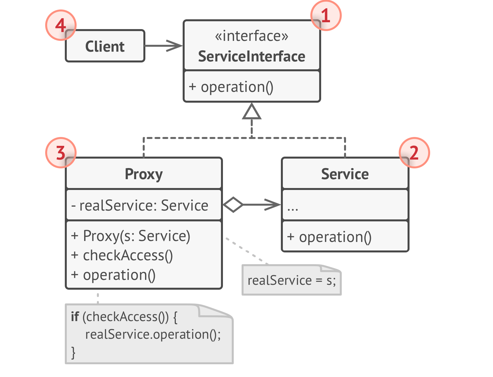

# Заместитель
**Заместитель** (***Proxy***) — это структурный паттерн проектирования, который позволяет подставлять вместо реальных 
объектов специальные объекты-заменители. Эти объекты перехватывают вызовы к оригинальному объекту, позволяя сделать 
что-то до или после передачи вызова оригиналу.

## Проблема
1) Необходимость контролировать доступ к объекту: Возникает, когда нельзя предоставлять прямой доступ к объекту всем 
клиентам, например, по соображениям безопасности, производительности или архитектуры.

2) Дорогостоящее создание объекта: Создание объекта может быть ресурсоемкой операцией. Если объект не всегда нужен, его 
создание каждый раз приводит к неэффективному использованию ресурсов.

3) Необходимость расширить функциональность объекта без изменения его кода: Требуется добавить новую функциональность к 
существующему объекту, но изменение исходного кода невозможно или нежелательно.

4) Удаленное взаимодействие с объектами: Взаимодействие с удаленными объектами требует обработки сетевых соединений и 
сериализации данных, что усложняет клиентский код.

5) Ограничение доступа к определенным методам объекта: Необходимо разрешить доступ только к определенным методам объекта, 
запретив вызов других методов.

## Решение
Паттерн заместитель предлагает создать новый класс-дублёр, имеющий тот же интерфейс, что и оригинальный служебный
объект. При получении запроса от клиента, объект-заместитель сам бы создавал экземпляр служебного объекта и
переадресовывал бы ему всю реальную работу.

## Структура

1) Интерфейс сервиса определяет общий интерфейс для cервиса и заместителя. Благодаря этому, объект заместителя можно 
использовать там, где ожидается объект сервиса. 
2) Сервис содержит полезную бизнес-логику. 
3) Заместитель хранит ссылку на объект сервиса. После того
   как заместитель заканчивает свою работу (например,
   инициализацию, логирование, защиту или другое), он
   передаёт вызовы вложенному сервису.
   Заместитель может сам отвечать за создание и удаление
   объекта сервиса. 
4) Клиент работает с объектами через интерфейс сервиса.
   Благодаря этому, его можно «одурачить», подменив объект
   сервиса объектом заместителя.

## Примеры
### Аналогия из жизни
Банковский чек — это заместитель пачки наличности. И чек, и наличность имеют общий интерфейс — ими можно оплачивать
товары. Для покупателя польза в том, что не надо таскать с собой тонны наличности. А владелец магазина может превратить
чек в зелёные бумажки, обратившись в банк.

### Данный пример
Пример защищающего прокси. Есть какой-то сервис, который читает файл, а есть его прокси, который проверяет доступ.
Клиент работает с прокси.

### Из JDK
1) java.lang.reflect.Proxy: Это самый явный пример. Позволяет создавать динамические прокси-объекты во время выполнения.
Эти прокси перехватывают вызовы методов к целевому объекту, позволяя добавлять дополнительную логику (например, 
логирование, кэширование).

2) java.sql.DriverManager и java.sql.Driver: DriverManager использует Driver как прокси для подключения к базе данных. 
Различные реализации Driver предоставляют доступ к разным типам баз данных.

3) java.lang.Class#getClassLoader: Метод getClassLoader может возвращать прокси-загрузчик классов, который делегирует 
загрузку классов родительскому загрузчику.

4) java.util.Collections: Некоторые методы в Collections, такие как unmodifiableList(), возвращают прокси-объекты, которые 
обеспечивают доступ только для чтения к исходной коллекции.

### Дополнительно
Вариации:
1) Ленивая инициализация (виртуальный прокси). Когда у вас есть тяжёлый объект, грузящий данные из файловой системы или 
базы данных.
2) Защита доступа (защищающий прокси). Когда в программе есть разные типы пользователей и вам хочется защищать объект от
неавторизованного доступа. Например, если ваши объекты — это важная часть операционной системы, а пользователи — 
сторонние программы (хорошие или вредоносные).
3) Локальный запуск сервиса (удалённый прокси). Когда настоящий сервисный объект находится на удалённом сервере.
4) Логирование запросов (логирующий прокси). Когда требуется хранить историю обращений к сервисному объекту.
5) Кеширование объектов («умная» ссылка). Когда нужно кешировать результаты запросов клиентов и управлять их жизненным 
циклом.